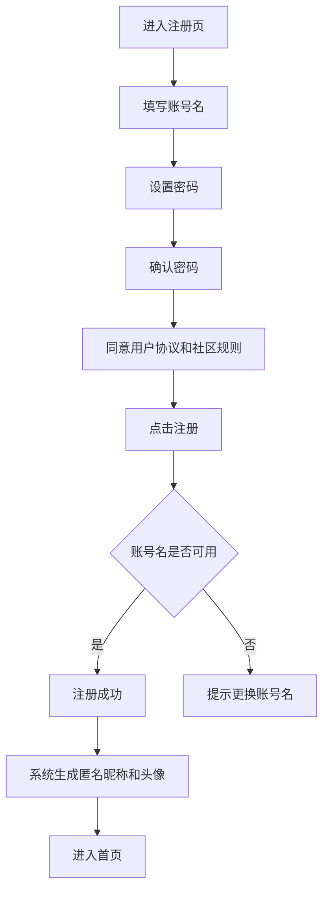
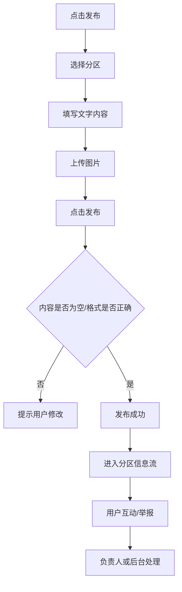
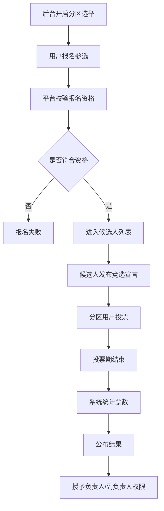
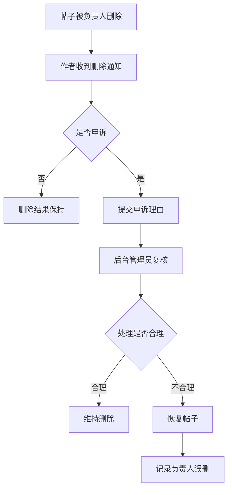
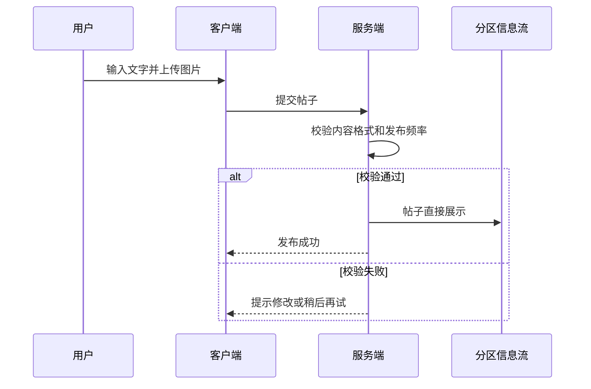
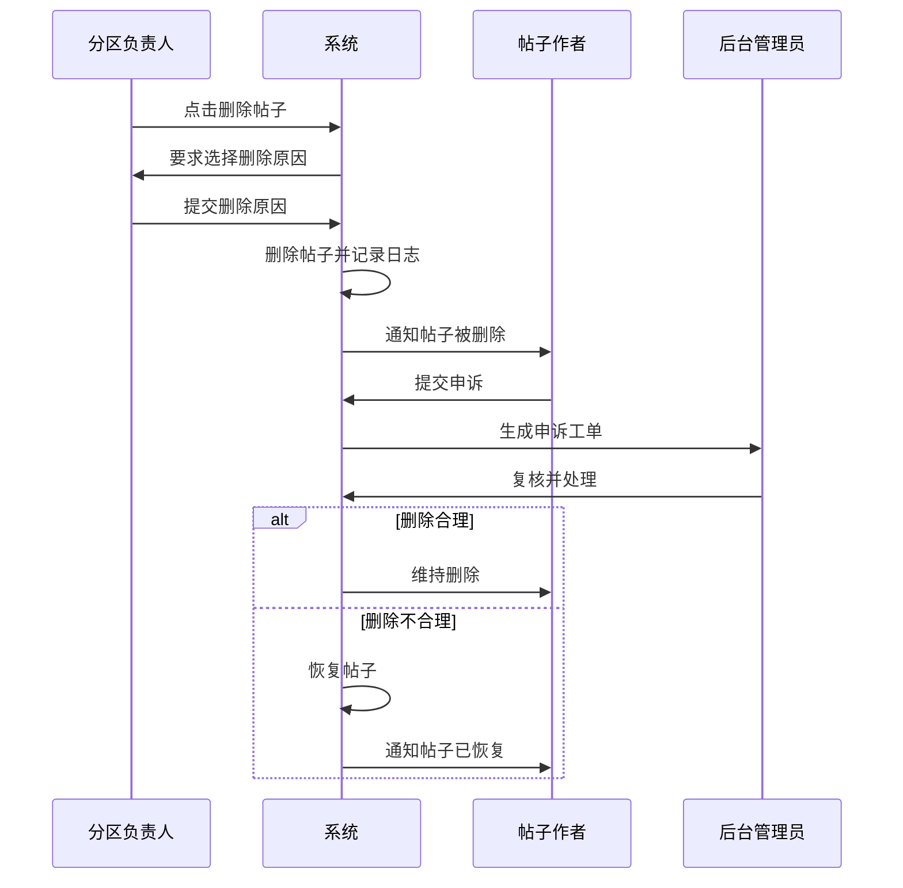
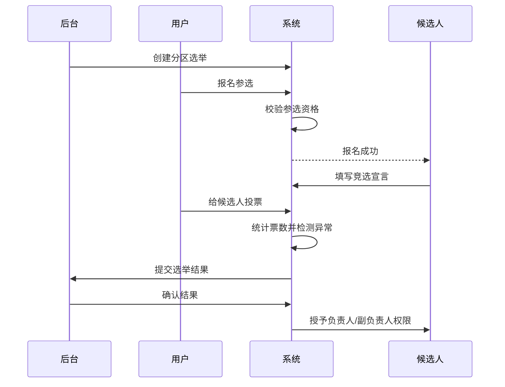

### **已调整：账号体系改为普通账号注册，发帖改为先发后管，分区增加“负责人/副负责人选举治理”机制**

可以把产品从“强后台审核型社区”调整为“分区自治型匿名社区”。前期用户直接注册账号即可使用，不强制手机号；每个分区通过选举产生负责人和副负责人，负责人拥有删帖、维护分区秩序、处理举报等权限；发帖默认不需要审核，发布后再由分区负责人、后台管理员和举报机制共同治理。

下面是基于你新增要求后的 PRD 修订版内容，可直接替换进上一版 PRD。

---

## **一、核心策略调整**

本版本将平台治理模式从“平台集中审核”调整为“平台规则 + 分区自治 + 事后治理”。用户注册时不需要手机号验证，只需要创建账号即可进入平台。用户发布内容时不需要等待审核，提交后直接展示，提高发帖效率和社区活跃度。

每个分区设立负责人和副负责人。负责人由分区用户通过选举产生，负责维护分区内容质量、删除违规帖子、处理部分举报、组织分区活动、推动分区氛围建设。副负责人协助负责人管理分区，并在负责人不活跃或违规时承担替补职责。

这种机制更适合前期冷启动，因为它可以降低注册和发布门槛，让用户更快参与内容生产。同时，通过分区负责人制度，把部分社区治理能力下放给活跃用户，减少平台早期运营压力。

---

## **二、账号注册与登录模块修订**

### **2.1 功能说明**

前期不采用手机号登录，也不强制绑定手机号。用户可以通过用户名、密码完成注册和登录。注册成功后，系统自动生成匿名昵称和默认头像，用户可以进入平台浏览、发帖、评论、点赞和私聊。

账号体系以低门槛为核心，优先保证用户能够快速进入社区。但由于不绑定手机号，平台需要通过账号限制、设备限制、IP 风控、注册频率限制等方式降低恶意注册和刷号风险。

### **2.2 注册流程**

### **2.3 注册字段**

| 字段 | 是否必填 | 说明 |
|---|---:|---|
| 账号名 | 是 | 用于登录，不一定对外展示 |
| 密码 | 是 | 用于账号登录 |
| 确认密码 | 是 | 防止输入错误 |
| 邀请码 | 否 | 可用于内测或分区冷启动 |
| 用户协议确认 | 是 | 注册前必须同意 |
| 社区规则确认 | 是 | 强化匿名社区规则意识 |

### **2.4 登录方式**

| 登录方式 | 是否支持 | 说明 |
|---|---:|---|
| 账号名 + 密码登录 | 是 | MVP 默认方式 |
| 手机号登录 | 否 | 前期不做 |
| 第三方登录 | 否 | 后续可扩展 |
| 游客浏览 | 可选 | 可允许游客只浏览，不互动 |

### **2.5 账号安全规则**

由于前期不使用手机号，账号找回能力会比较弱。因此建议至少支持以下机制：用户可以设置密保问题、绑定邮箱，或者在后续版本中补充手机号/邮箱找回。MVP 如果追求极简，也可以先不做找回，但需要在注册时提示用户妥善保存账号和密码。

### **2.6 风控规则**

| 风控项 | 规则建议 |
|---|---|
| 同设备注册限制 | 同一设备每日最多注册 3 个账号 |
| 同 IP 注册限制 | 同一 IP 每小时最多注册一定数量账号 |
| 新账号发帖限制 | 新账号注册后短时间内限制高频发帖 |
| 新账号私聊限制 | 新账号每日可发起私聊次数有限 |
| 异常行为限制 | 高频发帖、刷赞、刷评论触发临时限制 |
| 封禁关联 | 严重违规账号可关联设备或 IP 限制 |

---

## **三、发帖机制修订：默认无需审核**

### **3.1 功能说明**

用户在任意开放分区发布帖子时，不需要等待后台审核。点击发布后，帖子直接进入对应分区信息流并对其他用户可见。

平台从“先审后发”调整为“先发后管”。内容治理主要依靠用户举报、分区负责人巡查、后台管理员抽查、敏感词提醒和违规后处罚机制。

### **3.2 发帖流程**

### **3.3 发布规则**

所有用户发帖默认直接展示。平台可以保留基础校验，例如正文不能为空、图片格式合法、图片大小符合限制、发帖频率不能异常。敏感词可以不做硬审核，但建议做弱提醒，例如用户输入明显违规内容时，系统提示“该内容可能违反社区规则，请谨慎发布”。

不建议完全取消所有机器规则。即使不做审核，也需要保留极基础的技术校验和频率限制，否则很容易被广告、刷屏和恶意注册破坏社区氛围。

### **3.4 帖子状态修订**

| 状态 | 说明 |
|---|---|
| 已发布 | 用户发布后直接展示 |
| 已删除 | 用户本人、分区负责人或后台删除 |
| 已隐藏 | 后台临时隐藏，通常用于争议内容处理 |
| 被举报待处理 | 内容被用户举报，等待负责人或后台处理 |
| 申诉中 | 作者对删除结果发起申诉 |
| 已恢复 | 删除或隐藏后，经处理重新展示 |

### **3.5 删除权限**

| 角色 | 删除权限 |
|---|---|
| 帖子作者 | 可以删除自己的帖子 |
| 分区负责人 | 可以删除本分区帖子 |
| 分区副负责人 | 可以删除本分区帖子，或根据权限配置为协助处理 |
| 后台管理员 | 可以删除全站帖子 |
| 普通用户 | 不能删除他人帖子，但可以举报 |

---

## **四、分区负责人和副负责人机制**

## **4.1 功能说明**

每个分区可以设置一名负责人和若干名副负责人。负责人和副负责人通过用户选举产生，负责维护该分区秩序和氛围。

负责人不是平台员工，而是社区自治角色。其主要价值是让活跃用户参与治理，让不同分区形成自己的文化和规则。

### **4.2 角色定义**

| 角色 | 定位 | 核心权限 |
|---|---|---|
| 分区负责人 | 分区主要管理者 | 删帖、处理举报、编辑分区公告、发起活动 |
| 分区副负责人 | 分区协助管理者 | 协助删帖、处理举报、维护评论秩序 |
| 后台管理员 | 平台最终管理者 | 全站管理、负责人任免、权限回收、申诉处理 |
| 普通用户 | 分区参与者 | 发帖、评论、点赞、举报、投票 |

### **4.3 负责人权限**

负责人可以管理其负责分区内的帖子和部分运营内容。建议 MVP 阶段先开放删帖、处理举报、设置分区公告、查看基础分区数据等能力。

| 权限 | 负责人 | 副负责人 | 后台管理员 |
|---|---:|---:|---:|
| 删除本分区帖子 | 是 | 是 | 是 |
| 隐藏本分区帖子 | 是 | 是 | 是 |
| 处理本分区举报 | 是 | 是 | 是 |
| 编辑分区公告 | 是 | 可选 | 是 |
| 编辑分区规则 | 可申请 | 否 | 是 |
| 封禁用户 | 否 | 否 | 是 |
| 禁言用户 | 可建议 | 可建议 | 是 |
| 任免负责人 | 否 | 否 | 是 |
| 查看全站数据 | 否 | 否 | 是 |

建议前期不要让负责人直接封禁用户。负责人可以删除帖子、处理举报、提交禁言建议，但最终封禁和禁言仍由后台管理员执行。这样可以避免负责人滥用权力或因私人矛盾打压用户。

---

## **五、分区选举机制**

## **5.1 功能说明**

分区负责人和副负责人通过选举产生。达到一定活跃条件的用户可以报名参选，分区用户可以投票。选举结束后，票数最高者成为负责人，后续若干名成为副负责人。

选举机制既是治理工具，也是社区玩法。它可以提升用户参与感，让分区管理者获得一定正当性。

### **5.2 选举流程**

### **5.3 选举周期**

| 配置项 | 建议规则 |
|---|---|
| 任期 | 30 天或 90 天 |
| 报名期 | 3 天 |
| 投票期 | 3 天 |
| 公示期 | 1 天 |
| 连任规则 | 可以连任，但连续任期可设置上限 |
| 提前罢免 | 支持用户举报或后台介入 |

MVP 阶段可以采用较短周期，例如 30 天，方便平台观察负责人制度是否有效。如果社区稳定后，可以改为 90 天或更长。

### **5.4 参选资格**

为了避免小号、广告号或恶意用户当选，建议设置基础参选门槛。

| 条件 | 建议规则 |
|---|---|
| 账号注册时间 | 注册满 7 天或 14 天 |
| 分区活跃度 | 在该分区发帖或评论达到一定数量 |
| 违规记录 | 最近 30 天无严重违规 |
| 被举报情况 | 被有效举报次数低于阈值 |
| 账号状态 | 当前未被禁言、封禁 |
| 竞选宣言 | 必须填写分区治理计划 |

### **5.5 投票资格**

为了避免刷票，建议投票用户也需要满足一定条件。

| 条件 | 建议规则 |
|---|---|
| 账号注册时间 | 注册满 3 天 |
| 分区参与记录 | 在该分区浏览、发帖、评论达到最低门槛 |
| 投票次数 | 每个用户每次选举只能投 1 票 |
| 反作弊 | 同设备、同 IP 大量投票需风控 |
| 账号状态 | 被封禁或禁言用户不能投票 |

### **5.6 当选规则**

默认规则可以设为：票数第一名成为负责人，票数第二、第三名成为副负责人。如果分区较大，可以配置更多副负责人名额。若候选人数不足，可由后台临时任命负责人，或者让分区进入“暂无负责人”状态，由后台代管。

### **5.7 罢免机制**

负责人和副负责人拥有删帖权，因此必须设计约束机制。用户可以对负责人发起投诉，后台可以查看其删帖记录、举报处理记录和用户反馈。如果负责人长期不活跃、滥用删帖、恶意打压用户、引导违规内容，后台可以撤销其权限。

### **5.8 负责人操作日志**

负责人和副负责人所有管理动作都必须被记录。

| 日志字段 | 说明 |
|---|---|
| 操作人 ID | 哪个负责人执行操作 |
| 操作角色 | 负责人或副负责人 |
| 操作类型 | 删除、隐藏、恢复、处理举报 |
| 操作对象 | 帖子 ID、评论 ID、举报 ID |
| 操作原因 | 必须选择或填写 |
| 操作时间 | 记录精确时间 |
| 是否被申诉 | 作者是否提出申诉 |
| 后台复核结果 | 后台是否确认处理合理 |

---

## **六、删帖与申诉机制**

## **6.1 删帖规则**

负责人和副负责人可以删除本分区内明显违反分区规则或社区公约的帖子。删除时必须选择原因，并可填写补充说明。帖子删除后，作者会收到系统通知。

### **删除原因配置**

| 删除原因 | 说明 |
|---|---|
| 与分区主题无关 | 内容明显不属于当前分区 |
| 恶意刷屏 | 重复发布、灌水、广告刷屏 |
| 人身攻击 | 对其他用户进行辱骂、攻击 |
| 隐私泄露 | 发布他人个人信息 |
| 广告导流 | 引导加外部联系方式或营销 |
| 违规图片 | 图片内容不符合社区规则 |
| 其他原因 | 需要填写具体说明 |

### **删除后用户通知**

用户帖子被删除后，应收到类似通知：

> 你的帖子因“与分区主题无关”被分区负责人删除。如你认为处理有误，可以在 48 小时内提交申诉。

### **6.2 申诉机制**

为了防止负责人滥用权限，作者可以对删帖结果发起申诉。申诉由后台管理员处理，而不是由原负责人自行处理。

### **6.3 负责人滥用处理**

如果负责人多次误删、恶意删帖或引发大量有效投诉，后台可以采取以下处理：

| 处理方式 | 说明 |
|---|---|
| 警告 | 轻度误操作 |
| 暂停管理权限 | 暂时不能删帖 |
| 降级为普通用户 | 取消负责人或副负责人身份 |
| 禁止再次参选 | 一定周期内不得报名选举 |
| 平台处罚 | 严重违规时可禁言或封禁 |

---

## **七、后台管理端修订**

## **7.1 分区负责人管理**

后台需要新增“负责人管理”模块，用于查看、配置和干预各分区负责人。

### **功能清单**

| 功能 | 优先级 | 说明 |
|---|---|---|
| 查看分区负责人 | P0 | 查看每个分区当前负责人和副负责人 |
| 手动任命负责人 | P1 | 冷启动时可由后台指定 |
| 撤销负责人权限 | P0 | 处理滥用或不活跃负责人 |
| 查看负责人操作日志 | P0 | 审查删帖和举报处理行为 |
| 查看负责人被投诉记录 | P1 | 判断是否需要干预 |
| 设置负责人任期 | P1 | 配置 30 天/90 天等周期 |
| 设置副负责人数量 | P1 | 不同分区可配置不同名额 |

### **7.2 选举管理**

后台需要支持发起、暂停、结束和复核选举。

| 功能 | 优先级 | 说明 |
|---|---|---|
| 发起分区选举 | P0 | 后台选择分区并创建选举 |
| 设置报名时间 | P0 | 控制报名周期 |
| 设置投票时间 | P0 | 控制投票周期 |
| 审核候选人资格 | P1 | 防止恶意用户参选 |
| 查看投票数据 | P0 | 展示实时或最终票数 |
| 风控异常投票 | P1 | 识别刷票行为 |
| 公布选举结果 | P0 | 结果同步到分区页面 |
| 授权负责人权限 | P0 | 选举结束后自动或手动授权 |

### **7.3 帖子管理修订**

由于发帖不需要审核，后台帖子管理模块从“审核中心”改为“内容管理中心”。后台重点处理被举报内容、高风险内容、负责人删帖复核和全站抽查。

| 模块 | 说明 |
|---|---|
| 全部帖子 | 查看所有已发布帖子 |
| 被举报帖子 | 优先处理举报较多的帖子 |
| 已删除帖子 | 查看作者、删除人、删除原因 |
| 申诉帖子 | 处理作者申诉 |
| 热门帖子 | 监控高曝光内容 |
| 风险帖子 | 根据关键词、举报、互动异常识别 |

---

## **八、用户端页面新增与调整**

## **8.1 分区首页增加负责人展示**

每个分区首页应展示当前负责人和副负责人，让用户知道该分区由谁维护。

### **展示内容**

| 内容 | 说明 |
|---|---|
| 当前负责人 | 显示匿名昵称和头像 |
| 副负责人 | 显示若干名副负责人 |
| 任期时间 | 当前任期开始和结束时间 |
| 分区公告 | 由负责人或后台发布 |
| 分区规则 | 展示该分区的内容边界 |
| 投诉入口 | 用户可投诉负责人行为 |

### **8.2 选举页面**

平台需要新增选举页面，用户可以查看正在进行的分区选举、候选人列表、竞选宣言和投票入口。

### **选举页面结构**

| 区域 | 内容 |
|---|---|
| 选举说明 | 展示本次选举目的和规则 |
| 候选人列表 | 展示候选人头像、昵称、宣言 |
| 候选人详情 | 查看候选人的分区贡献 |
| 投票按钮 | 每个用户只能投一票 |
| 投票结果 | 投票结束后展示结果 |
| 举报候选人 | 发现刷票或违规可举报 |

### **8.3 负责人管理入口**

负责人和副负责人进入自己负责的分区后，可以看到普通用户没有的管理入口。

### **负责人可见功能**

| 功能 | 说明 |
|---|---|
| 删除帖子 | 删除不符合规则的帖子 |
| 处理举报 | 查看本分区举报内容 |
| 发布公告 | 发布分区通知或活动 |
| 查看分区数据 | 查看发帖数、评论数、活跃用户 |
| 查看操作记录 | 查看自己的管理操作 |

---

## **九、核心业务流程修订**

## **9.1 直接发帖流程**

## **9.2 分区负责人删帖流程**

## **9.3 分区选举流程**

---

## **十、数据结构补充**

## **10.1 分区负责人表 CategoryModerator**

| 字段 | 类型 | 说明 |
|---|---|---|
| moderator_id | string | 记录 ID |
| category_id | string | 分区 ID |
| user_id | string | 用户 ID |
| role | enum | 负责人、副负责人 |
| status | enum | 在任、暂停、已卸任 |
| term_start_at | datetime | 任期开始时间 |
| term_end_at | datetime | 任期结束时间 |
| elected_by | string | 选举 ID 或后台任命 |
| created_at | datetime | 创建时间 |

## **10.2 选举表 Election**

| 字段 | 类型 | 说明 |
|---|---|---|
| election_id | string | 选举 ID |
| category_id | string | 分区 ID |
| title | string | 选举标题 |
| status | enum | 报名中、投票中、公示中、已结束、已取消 |
| signup_start_at | datetime | 报名开始时间 |
| signup_end_at | datetime | 报名结束时间 |
| vote_start_at | datetime | 投票开始时间 |
| vote_end_at | datetime | 投票结束时间 |
| result_published_at | datetime | 结果发布时间 |

## **10.3 候选人表 ElectionCandidate**

| 字段 | 类型 | 说明 |
|---|---|---|
| candidate_id | string | 候选人记录 ID |
| election_id | string | 选举 ID |
| user_id | string | 候选用户 ID |
| manifesto | text | 竞选宣言 |
| status | enum | 待确认、有效、取消资格 |
| vote_count | int | 得票数 |
| created_at | datetime | 报名时间 |

## **10.4 投票表 ElectionVote**

| 字段 | 类型 | 说明 |
|---|---|---|
| vote_id | string | 投票 ID |
| election_id | string | 选举 ID |
| candidate_id | string | 候选人 ID |
| voter_user_id | string | 投票用户 ID |
| device_id | string | 设备 ID |
| ip | string | 投票 IP |
| created_at | datetime | 投票时间 |

## **10.5 管理操作日志表 ModerationLog**

| 字段 | 类型 | 说明 |
|---|---|---|
| log_id | string | 日志 ID |
| operator_user_id | string | 操作人 ID |
| operator_role | enum | 负责人、副负责人、后台管理员 |
| category_id | string | 所属分区 |
| action_type | enum | 删除帖子、隐藏帖子、恢复帖子、处理举报 |
| target_type | enum | 帖子、评论、举报 |
| target_id | string | 目标内容 ID |
| reason | string | 操作原因 |
| remark | text | 补充说明 |
| created_at | datetime | 操作时间 |

---

## **十一、MVP 优先级调整**

### **P0：必须实现**

| 模块 | 功能 |
|---|---|
| 账号 | 账号名密码注册、登录、退出 |
| 匿名身份 | 自动昵称、默认头像、修改昵称头像 |
| 分区 | 分区列表、分区详情、后台创建编辑分区 |
| 发帖 | 文字、图片、直接发布 |
| 互动 | 点赞、评论、私聊 |
| 举报 | 举报帖子、评论、用户 |
| 分区治理 | 负责人、副负责人角色 |
| 删帖 | 负责人/副负责人删除本分区帖子 |
| 日志 | 负责人删帖日志 |
| 后台 | 分区管理、帖子管理、用户管理、负责人管理 |

### **P1：建议尽快实现**

| 模块 | 功能 |
|---|---|
| 选举 | 分区负责人选举 |
| 申诉 | 用户对删帖结果发起申诉 |
| 投诉 | 用户投诉负责人 |
| 风控 | 注册、发帖、投票频率限制 |
| 分区公告 | 负责人发布分区公告 |
| 数据 | 分区基础数据看板 |

### **P2：后续增强**

| 模块 | 功能 |
|---|---|
| 选举风控 | 刷票识别、异常票剔除 |
| 负责人评价 | 用户对负责人任期评分 |
| 自动换届 | 任期结束自动开启新选举 |
| 权限细分 | 不同分区配置不同负责人权限 |
| 分区自治规则 | 分区可自定义更细规则 |
| 贡献体系 | 参选资格与贡献值绑定 |

---

## **十二、修订后的产品定位表达**

可以把产品定位改成下面这个版本：

本产品是一款以匿名表达、兴趣分区和社区自治为核心的社交平台。用户可以低门槛注册账号，在不同分区中匿名发布文字和图片内容，参与点赞、评论、私聊等互动。平台通过分区负责人和副负责人机制，让活跃用户参与分区治理。负责人由分区用户选举产生，拥有本分区删帖、处理举报、发布公告等权限。平台后台保留最终管理权，用于处理申诉、撤销滥用权限、维护社区整体秩序。

---

## **十三、我对这次调整的设计说明**

我把登录体系从手机号验证码改成了“账号名 + 密码注册”，这样更符合你说的前期低门槛方向。匿名社交产品早期最重要的是让用户快速进入、快速发帖、快速互动，手机号登录虽然更安全，但会提高进入门槛。

我把发帖机制从“审核后发布”改成了“直接发布”。这会提升内容生产效率，尤其适合冷启动阶段。但我保留了格式校验、频率限制、举报、删帖、后台复核这些机制，因为完全无约束会很容易被刷屏和广告破坏。

我新增了分区负责人和副负责人机制，并把它设计成“选举产生 + 权限有限 + 后台兜底”。这样既能体现社区自治，也能防止负责人权力过大。负责人可以删帖，但不能直接封禁用户；用户可以申诉，后台可以撤销负责人权限。

我还补充了选举资格、投票资格、任期、罢免和操作日志。原因是只要负责人能删帖，就必须有监督机制，否则后期很容易出现滥权、拉帮结派、恶意删帖的问题。这个机制前期可以做简单版，但数据结构和流程最好一开始就预留。

*内容由 AI 生成仅供参考*