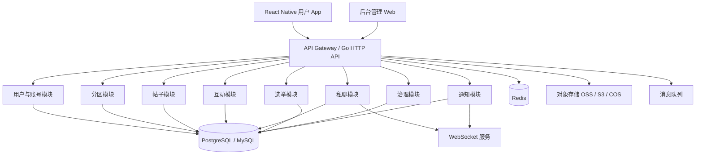
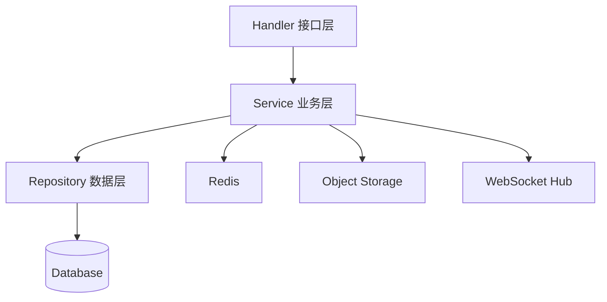
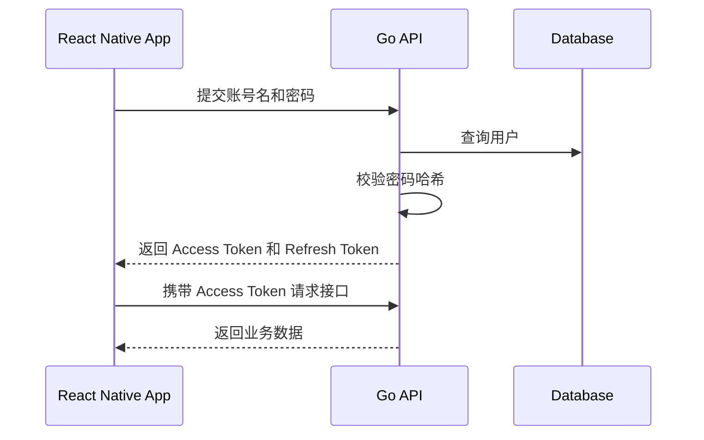
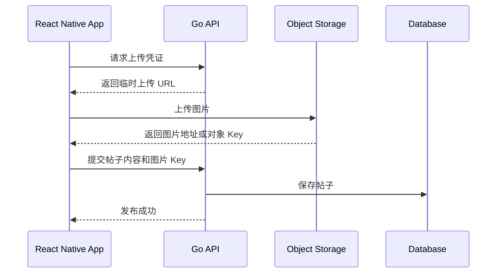
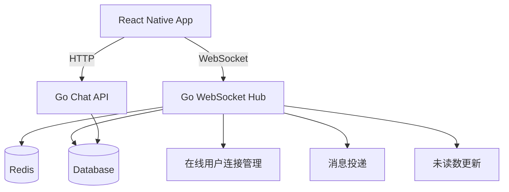
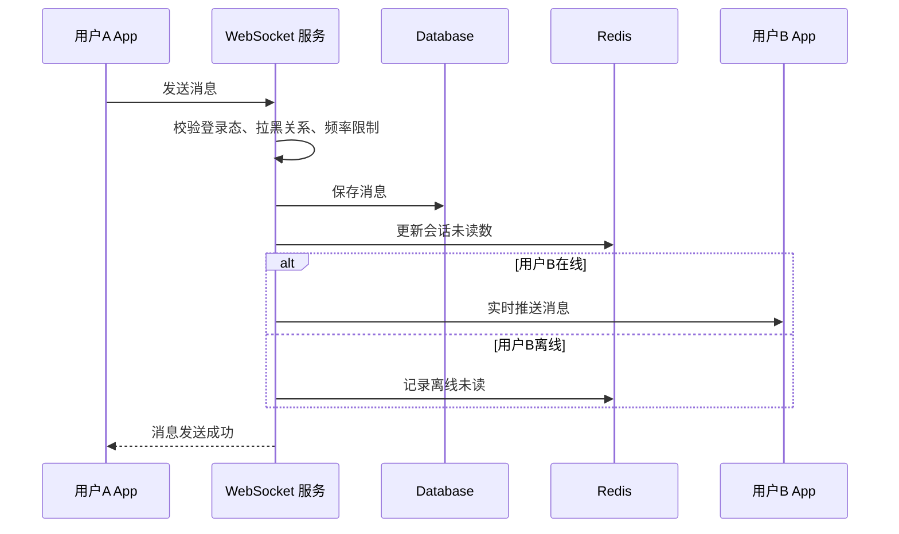
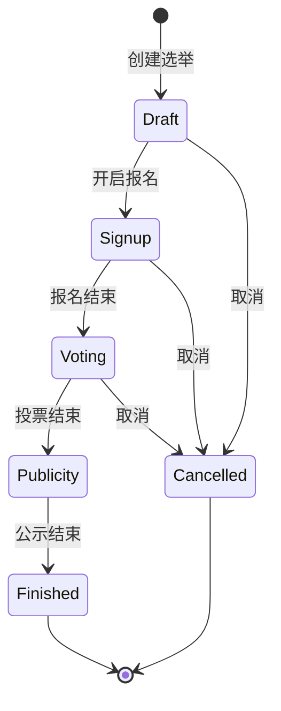
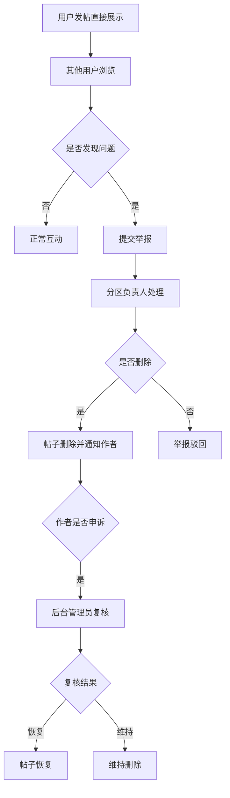
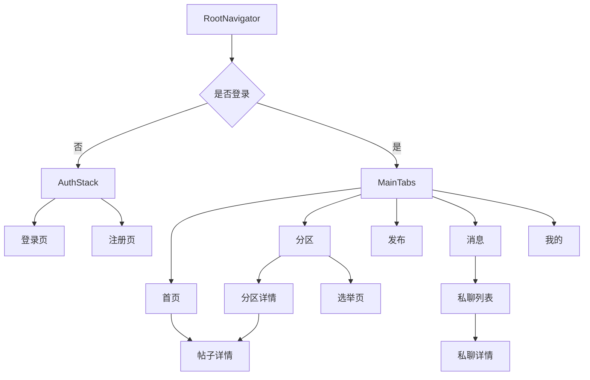
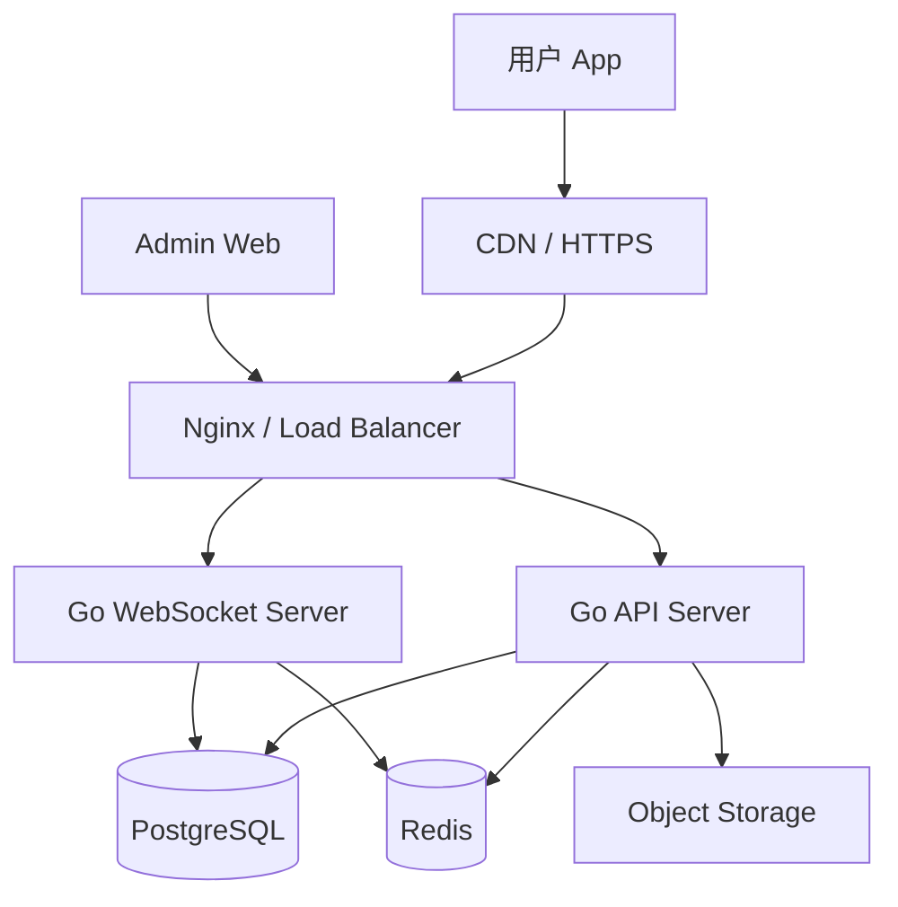

### **技术方案建议采用 React Native 单端多端复用，Go 后端按模块化单体起步，预留微服务拆分能力**

前期建议不要直接上复杂微服务，而是采用“React Native App + Go 模块化单体 + PostgreSQL/MySQL + Redis + 对象存储 + WebSocket”的方案。这样既能快速上线 MVP，又能支撑匿名发帖、图片上传、分区自治、选举、点赞评论、私聊、删帖、后台管理等核心能力。

---

## **一、整体技术架构**

产品可以分为四端：用户 App、后台管理 Web、服务端 API、基础设施服务。



前期建议后端采用模块化单体架构，也就是一个 Go 项目内按业务模块拆分代码，但部署为一个主服务。这样可以避免早期微服务带来的部署、链路追踪、服务治理和数据一致性成本。后续如果私聊、推荐、审核、通知等模块压力变大，可以再拆分为独立服务。

---

## **二、技术选型**

### **2.1 前端用户端**

| 技术 | 用途 | 建议 |
|---|---|---|
| React Native | App 主框架 | 核心技术栈 |
| TypeScript | 类型约束 | 必选 |
| React Navigation | 页面路由 | 必选 |
| Zustand / Redux Toolkit | 状态管理 | 二选一，推荐 Zustand 起步 |
| TanStack Query | 接口请求与缓存 | 推荐 |
| Axios / Fetch | HTTP 请求 | Axios 更易封装 |
| MMKV / AsyncStorage | 本地存储 | Token、草稿、轻量缓存 |
| React Native Image Picker | 图片选择 | 发帖上传图片 |
| React Native Fast Image | 图片加载优化 | 推荐 |
| Socket.IO Client / 原生 WebSocket | 私聊长连接 | 推荐 WebSocket |
| Sentry / 自建日志 | 错误监控 | 推荐接入 |

React Native 端需要重点关注图片上传、信息流性能、聊天消息实时性、本地缓存和页面状态恢复。匿名社交类产品的核心体验在于“刷内容顺滑、发帖简单、消息及时”。

### **2.2 后台管理端**

| 技术 | 用途 | 建议 |
|---|---|---|
| React / Vue | 后台 Web | 二选一 |
| Ant Design / Arco Design | 后台 UI 组件 | 推荐 |
| TypeScript | 类型约束 | 推荐 |
| Vite | 构建工具 | 推荐 |
| RBAC 权限控制 | 后台权限 | 必选 |

后台管理端不建议用 React Native 做，应该用 Web 技术单独开发，方便管理员在 PC 上进行分区配置、帖子管理、用户管理、负责人管理、选举管理和申诉处理。

### **2.3 后端**

| 技术 | 用途 | 建议 |
|---|---|---|
| Go | 后端主语言 | 核心技术栈 |
| Gin / Fiber / Echo | HTTP 框架 | 推荐 Gin 或 Echo |
| GORM / SQLC | 数据访问 | 快速开发用 GORM，强类型用 SQLC |
| PostgreSQL / MySQL | 主数据库 | 推荐 PostgreSQL |
| Redis | 缓存、限流、计数、会话 | 必选 |
| WebSocket | 私聊与实时通知 | 必选 |
| Kafka / NATS / RabbitMQ | 消息队列 | MVP 可先不上，后续接入 |
| MinIO / S3 / OSS / COS | 图片对象存储 | 必选 |
| JWT | 用户认证 | 必选 |
| Casbin | 权限控制 | 后台和治理权限可用 |
| Zap / Zerolog | 日志 | 推荐 |
| Prometheus + Grafana | 监控 | 中期接入 |
| Docker | 部署 | 必选 |

---

## **三、后端架构设计**

## **3.1 架构方式：模块化单体优先**

前期推荐结构：

```text
server/
  cmd/
    api/
      main.go
    worker/
      main.go
  internal/
    config/
    middleware/
    router/
    pkg/
      auth/
      jwt/
      logger/
      response/
      validator/
      storage/
      websocket/
      limiter/
    modules/
      account/
      user/
      category/
      post/
      comment/
      like/
      chat/
      election/
      moderation/
      report/
      notification/
      admin/
  migrations/
  docs/
  scripts/
```

这种结构的好处是代码边界清楚，但运维部署简单。每个业务模块内部可以继续分为 handler、service、repository、model。

示例：

```text
internal/modules/post/
  handler.go
  service.go
  repository.go
  model.go
  dto.go
```

### **3.2 分层职责**



Handler 负责接收请求、参数校验和响应格式。Service 负责业务规则，例如发帖限制、负责人删帖权限、投票资格校验。Repository 负责数据库读写。这样可以避免业务逻辑散落在 Controller 里，后期维护会更清晰。

---

## **四、核心业务模块设计**

## **4.1 账号与匿名身份模块**

前期不使用手机号登录，采用账号名和密码注册。

### **核心功能**

| 功能 | 说明 |
|---|---|
| 注册账号 | 用户名 + 密码 |
| 登录 | 用户名 + 密码获取 Token |
| 退出登录 | 客户端删除 Token，服务端可维护 Token 黑名单 |
| 修改密码 | 需要旧密码 |
| 匿名昵称 | 注册后自动生成 |
| 默认头像 | 从头像池随机分配 |
| 用户资料 | 昵称、头像、签名 |
| 账号状态 | 正常、禁言、封禁、注销 |

### **认证方式**

App 登录成功后，服务端返回 Access Token 和 Refresh Token。Access Token 有效期较短，例如 2 小时；Refresh Token 有效期较长，例如 30 天。客户端用 Refresh Token 自动续期。



密码必须使用 bcrypt 或 argon2 哈希存储，不能明文保存。

---

## **4.2 分区模块**

分区是平台内容组织和自治治理的核心。

### **核心功能**

| 功能 | 用户端 | 后台 |
|---|---:|---:|
| 分区列表 | 是 | 是 |
| 分区详情 | 是 | 是 |
| 分区发帖 | 是 | 配置 |
| 分区公告 | 展示 | 编辑 |
| 分区规则 | 展示 | 编辑 |
| 分区负责人展示 | 是 | 管理 |
| 分区上下架 | 否 | 是 |
| 分区排序 | 否 | 是 |

### **分区配置建议**

每个分区都需要可配置以下字段：分区名称、图标、简介、规则、是否允许发图、是否允许私聊、是否启用、排序权重、负责人数量、副负责人数量、是否开启选举。

---

## **4.3 帖子模块**

发帖不需要审核，发布后直接进入信息流。

### **核心功能**

| 功能 | 说明 |
|---|---|
| 发布文字帖 | 必须选择分区 |
| 发布图片帖 | 支持多图上传 |
| 帖子列表 | 首页推荐、最新、热门、分区列表 |
| 帖子详情 | 正文、图片、评论、点赞、私聊入口 |
| 删除帖子 | 作者可删自己的帖子 |
| 负责人删帖 | 负责人可删本分区帖子 |
| 后台删帖 | 后台可删全站帖子 |
| 帖子申诉 | 作者可对负责人删帖发起申诉 |

### **图片上传流程**

建议采用“客户端直传对象存储”的方式，避免图片文件全部经过 Go API 服务，降低服务端压力。



如果前期想简单，也可以先由 App 上传到 Go API，再由 Go API 转存对象存储。但这种方式对服务器带宽压力更大，不适合图片较多的社区。

---

## **4.4 点赞模块**

点赞适合用数据库记录行为，用 Redis 做计数缓存。

### **设计规则**

同一用户对同一帖子只能点赞一次。再次点击则取消点赞。点赞关系需要落库，点赞数可以 Redis 增减后异步同步到数据库，或者直接事务更新数据库计数。

前期数据量不大时，可以直接数据库事务处理：

```text
开始事务
1. 查询用户是否已点赞
2. 未点赞则插入 like 记录，并 post.like_count + 1
3. 已点赞则删除 like 记录，并 post.like_count - 1
提交事务
```

中后期可以改成 Redis 计数 + 异步落库，提升性能。

---

## **4.5 评论模块**

MVP 阶段建议支持一级评论即可，不做楼中楼。后续可以增加 parent_comment_id 支持评论回复。

### **核心功能**

| 功能 | 说明 |
|---|---|
| 发布评论 | 发帖后直接展示 |
| 删除评论 | 评论作者、后台可删 |
| 负责人删除评论 | 可选，建议支持本分区评论删除 |
| 评论列表 | 按时间排序 |
| 评论通知 | 评论帖子后通知作者 |
| 评论举报 | 用户可举报评论 |

评论内容不需要审核，但需要保留基础风控，例如发评论频率限制、异常账号限制、被封禁或禁言用户不可评论。

---

## **4.6 私聊模块**

私聊建议使用 WebSocket 实现实时消息，同时保留 HTTP 接口用于历史消息拉取。

### **私聊架构**



### **核心功能**

| 功能 | 说明 |
|---|---|
| 发起私聊 | 从帖子详情、用户主页、评论区进入 |
| 会话列表 | 展示最近消息和未读数 |
| 消息详情 | 拉取历史消息 |
| 实时收发 | WebSocket |
| 已读状态 | MVP 可先做会话级已读 |
| 拉黑 | 拉黑后不能继续发送 |
| 举报私聊 | 用户可举报会话或单条消息 |

### **消息发送流程**



前期可以先支持文本消息，不建议一开始开放私聊图片。图片私聊会显著增加内容治理难度。

---

## **4.7 分区负责人模块**

负责人和副负责人是平台自治治理的核心。

### **核心功能**

| 功能 | 说明 |
|---|---|
| 查看负责人 | 分区页展示负责人和副负责人 |
| 授权负责人 | 选举结束后授权 |
| 负责人删帖 | 仅限本分区 |
| 负责人处理举报 | 仅限本分区 |
| 发布分区公告 | 可配置是否允许副负责人发布 |
| 操作日志 | 所有管理动作必须记录 |
| 投诉负责人 | 用户可投诉负责人 |
| 后台撤权 | 管理员可撤销负责人权限 |

### **权限校验逻辑**

后端所有管理接口都不能只依赖前端隐藏按钮，必须在 Go 服务端做权限校验。

例如负责人删帖：

```text
1. 校验用户是否登录
2. 查询帖子所属分区
3. 查询当前用户是否为该分区负责人或副负责人
4. 校验负责人状态是否在任
5. 执行删除
6. 写入管理操作日志
7. 通知帖子作者
```

---

## **4.8 选举模块**

分区负责人和副负责人通过选举产生。

### **核心功能**

| 功能 | 说明 |
|---|---|
| 后台创建选举 | 选择分区、报名期、投票期 |
| 用户报名参选 | 满足条件后可报名 |
| 候选人宣言 | 候选人填写治理计划 |
| 用户投票 | 符合资格的用户投票 |
| 票数统计 | 系统自动统计 |
| 异常投票识别 | 根据设备、IP、账号年龄风控 |
| 结果公示 | 投票结束后展示 |
| 自动授权 | 当选用户获得负责人权限 |

### **选举状态机**



### **投票防刷**

由于前期不使用手机号，选举模块一定要有反作弊机制。至少需要记录 voter_user_id、device_id、IP、注册时间、分区活跃度。投票资格不能只看账号是否存在，否则很容易被批量注册账号刷票。

---

## **4.9 举报、删帖与申诉模块**

这个模块用于弥补“发帖不审核”的风险。

### **治理链路**



### **核心功能**

| 功能 | 说明 |
|---|---|
| 举报帖子 | 用户可举报帖子 |
| 举报评论 | 用户可举报评论 |
| 举报用户 | 用户可举报主页或行为 |
| 举报私聊 | 用户可举报聊天内容 |
| 负责人处理举报 | 仅处理本分区内容 |
| 后台复核 | 处理申诉和复杂举报 |
| 申诉 | 作者可申诉删帖 |
| 操作日志 | 删除、恢复、驳回都要记录 |

---

## **五、数据库设计**

以下以 PostgreSQL 为例，MySQL 也可以实现。字段类型可以根据实际 ORM 调整。

## **5.1 users 用户表**

| 字段 | 类型 | 说明 |
|---|---|---|
| id | bigint | 主键 |
| username | varchar | 登录账号名，唯一 |
| password_hash | varchar | 密码哈希 |
| nickname | varchar | 匿名昵称 |
| avatar_url | varchar | 头像 |
| bio | varchar | 签名 |
| status | smallint | 正常、禁言、封禁、注销 |
| role | smallint | 普通用户、后台管理员等 |
| created_at | timestamp | 注册时间 |
| updated_at | timestamp | 更新时间 |
| last_login_at | timestamp | 最近登录时间 |

### **索引建议**

username 需要唯一索引。status、created_at 可根据后台查询需要建立普通索引。

---

## **5.2 categories 分区表**

| 字段 | 类型 | 说明 |
|---|---|---|
| id | bigint | 主键 |
| name | varchar | 分区名称 |
| icon_url | varchar | 分区图标 |
| description | text | 简介 |
| rules | text | 分区规则 |
| announcement | text | 分区公告 |
| allow_image | boolean | 是否允许图片 |
| enable_chat | boolean | 是否允许从帖子私聊 |
| enable_election | boolean | 是否开启选举 |
| status | smallint | 启用、停用 |
| sort_weight | int | 排序权重 |
| created_at | timestamp | 创建时间 |
| updated_at | timestamp | 更新时间 |

---

## **5.3 posts 帖子表**

| 字段 | 类型 | 说明 |
|---|---|---|
| id | bigint | 主键 |
| user_id | bigint | 作者 ID |
| category_id | bigint | 分区 ID |
| content | text | 正文 |
| status | smallint | 已发布、已删除、已隐藏 |
| delete_reason | varchar | 删除原因 |
| deleted_by | bigint | 删除人 |
| deleted_at | timestamp | 删除时间 |
| like_count | int | 点赞数 |
| comment_count | int | 评论数 |
| view_count | int | 浏览数 |
| hot_score | double | 热度分 |
| created_at | timestamp | 发布时间 |
| updated_at | timestamp | 更新时间 |

### **索引建议**

| 索引 | 用途 |
|---|---|
| category_id, created_at | 分区最新流 |
| created_at | 全站最新流 |
| hot_score | 热门排序 |
| user_id, created_at | 用户主页帖子 |
| status, created_at | 后台内容管理 |

---

## **5.4 post_images 帖子图片表**

| 字段 | 类型 | 说明 |
|---|---|---|
| id | bigint | 主键 |
| post_id | bigint | 帖子 ID |
| image_url | varchar | 图片 URL |
| object_key | varchar | 对象存储 Key |
| width | int | 图片宽度 |
| height | int | 图片高度 |
| sort_order | int | 排序 |
| created_at | timestamp | 创建时间 |

---

## **5.5 comments 评论表**

| 字段 | 类型 | 说明 |
|---|---|---|
| id | bigint | 主键 |
| post_id | bigint | 帖子 ID |
| user_id | bigint | 评论用户 |
| parent_id | bigint | 父评论 ID，MVP 可默认为 0 |
| content | text | 评论内容 |
| status | smallint | 正常、删除、隐藏 |
| deleted_by | bigint | 删除人 |
| deleted_at | timestamp | 删除时间 |
| created_at | timestamp | 创建时间 |

---

## **5.6 likes 点赞表**

| 字段 | 类型 | 说明 |
|---|---|---|
| id | bigint | 主键 |
| user_id | bigint | 用户 ID |
| target_type | smallint | 帖子、评论 |
| target_id | bigint | 目标 ID |
| created_at | timestamp | 创建时间 |

点赞表需要建立唯一索引：

```text
unique(user_id, target_type, target_id)
```

这样可以防止重复点赞。

---

## **5.7 conversations 会话表**

| 字段 | 类型 | 说明 |
|---|---|---|
| id | bigint | 主键 |
| user_a_id | bigint | 用户 A |
| user_b_id | bigint | 用户 B |
| status | smallint | 正常、拉黑、关闭 |
| last_message_id | bigint | 最后一条消息 ID |
| last_message_at | timestamp | 最后消息时间 |
| created_at | timestamp | 创建时间 |

建议建立唯一约束，保证两个用户之间只有一个会话。可以用较小 user_id 和较大 user_id 存储，避免 A-B 和 B-A 重复。

---

## **5.8 messages 消息表**

| 字段 | 类型 | 说明 |
|---|---|---|
| id | bigint | 主键 |
| conversation_id | bigint | 会话 ID |
| sender_id | bigint | 发送者 |
| receiver_id | bigint | 接收者 |
| content | text | 消息内容 |
| message_type | smallint | 文本、系统 |
| status | smallint | 正常、撤回、删除 |
| created_at | timestamp | 发送时间 |

### **消息表优化建议**

消息量增长较快，后期可以按 conversation_id 或 created_at 分区。MVP 阶段先用普通表即可，但要预留分页游标接口，避免 offset 深分页性能问题。

---

## **5.9 category_moderators 分区负责人表**

| 字段 | 类型 | 说明 |
|---|---|---|
| id | bigint | 主键 |
| category_id | bigint | 分区 ID |
| user_id | bigint | 用户 ID |
| role | smallint | 负责人、副负责人 |
| status | smallint | 在任、暂停、卸任 |
| term_start_at | timestamp | 任期开始 |
| term_end_at | timestamp | 任期结束 |
| source_type | smallint | 选举、后台任命 |
| source_id | bigint | 选举 ID |
| created_at | timestamp | 创建时间 |

---

## **5.10 elections 选举表**

| 字段 | 类型 | 说明 |
|---|---|---|
| id | bigint | 主键 |
| category_id | bigint | 分区 ID |
| title | varchar | 选举标题 |
| status | smallint | 草稿、报名中、投票中、公示中、结束、取消 |
| signup_start_at | timestamp | 报名开始 |
| signup_end_at | timestamp | 报名结束 |
| vote_start_at | timestamp | 投票开始 |
| vote_end_at | timestamp | 投票结束 |
| publicity_end_at | timestamp | 公示结束 |
| created_by | bigint | 创建管理员 |
| created_at | timestamp | 创建时间 |

---

## **5.11 election_candidates 候选人表**

| 字段 | 类型 | 说明 |
|---|---|---|
| id | bigint | 主键 |
| election_id | bigint | 选举 ID |
| user_id | bigint | 候选人 |
| manifesto | text | 竞选宣言 |
| status | smallint | 有效、取消资格 |
| vote_count | int | 得票数 |
| created_at | timestamp | 报名时间 |

---

## **5.12 election_votes 投票表**

| 字段 | 类型 | 说明 |
|---|---|---|
| id | bigint | 主键 |
| election_id | bigint | 选举 ID |
| candidate_id | bigint | 候选人 ID |
| voter_user_id | bigint | 投票用户 ID |
| device_id | varchar | 设备 ID |
| ip | varchar | IP 地址 |
| user_agent | varchar | 设备信息 |
| created_at | timestamp | 投票时间 |

需要建立唯一索引：

```text
unique(election_id, voter_user_id)
```

确保同一用户在一次选举中只能投一次。

---

## **5.13 reports 举报表**

| 字段 | 类型 | 说明 |
|---|---|---|
| id | bigint | 主键 |
| reporter_id | bigint | 举报人 |
| target_type | smallint | 帖子、评论、用户、私聊消息 |
| target_id | bigint | 目标 ID |
| category_id | bigint | 所属分区 |
| reason_type | smallint | 举报类型 |
| reason_text | text | 补充说明 |
| status | smallint | 待处理、已处理、驳回 |
| handler_id | bigint | 处理人 |
| handler_role | smallint | 负责人、副负责人、后台管理员 |
| handled_at | timestamp | 处理时间 |
| created_at | timestamp | 举报时间 |

---

## **5.14 moderation_logs 管理操作日志表**

| 字段 | 类型 | 说明 |
|---|---|---|
| id | bigint | 主键 |
| operator_id | bigint | 操作人 |
| operator_role | smallint | 负责人、副负责人、后台管理员 |
| category_id | bigint | 分区 ID |
| action_type | smallint | 删除、隐藏、恢复、驳回举报等 |
| target_type | smallint | 帖子、评论、举报 |
| target_id | bigint | 操作对象 |
| reason | varchar | 操作原因 |
| remark | text | 补充说明 |
| created_at | timestamp | 操作时间 |

---

## **六、接口设计示例**

## **6.1 账号接口**

| 方法 | 路径 | 说明 |
|---|---|---|
| POST | /api/v1/auth/register | 注册 |
| POST | /api/v1/auth/login | 登录 |
| POST | /api/v1/auth/refresh | 刷新 Token |
| POST | /api/v1/auth/logout | 退出 |
| GET | /api/v1/users/me | 当前用户信息 |
| PUT | /api/v1/users/me | 修改资料 |

### **注册请求示例**

```json
{
  "username": "test_user",
  "password": "password123",
  "confirmPassword": "password123"
}
```

---

## **6.2 分区接口**

| 方法 | 路径 | 说明 |
|---|---|---|
| GET | /api/v1/categories | 分区列表 |
| GET | /api/v1/categories/:id | 分区详情 |
| GET | /api/v1/categories/:id/posts | 分区帖子列表 |
| GET | /api/v1/categories/:id/moderators | 分区负责人列表 |

---

## **6.3 帖子接口**

| 方法 | 路径 | 说明 |
|---|---|---|
| GET | /api/v1/posts/feed | 首页信息流 |
| POST | /api/v1/posts | 发帖 |
| GET | /api/v1/posts/:id | 帖子详情 |
| DELETE | /api/v1/posts/:id | 作者删除自己的帖子 |
| POST | /api/v1/posts/:id/like | 点赞 |
| DELETE | /api/v1/posts/:id/like | 取消点赞 |
| POST | /api/v1/posts/:id/report | 举报帖子 |

### **发帖请求示例**

```json
{
  "categoryId": 1,
  "content": "今天想找几个一起打游戏的朋友",
  "images": [
    {
      "objectKey": "posts/2026/06/xxx.jpg",
      "url": "https://cdn.example.com/posts/2026/06/xxx.jpg",
      "width": 1080,
      "height": 1080
    }
  ]
}
```

---

## **6.4 评论接口**

| 方法 | 路径 | 说明 |
|---|---|---|
| GET | /api/v1/posts/:id/comments | 评论列表 |
| POST | /api/v1/posts/:id/comments | 发表评论 |
| DELETE | /api/v1/comments/:id | 删除自己的评论 |
| POST | /api/v1/comments/:id/report | 举报评论 |

---

## **6.5 私聊接口**

| 方法 | 路径 | 说明 |
|---|---|---|
| GET | /api/v1/conversations | 会话列表 |
| POST | /api/v1/conversations | 创建或获取会话 |
| GET | /api/v1/conversations/:id/messages | 消息列表 |
| POST | /api/v1/conversations/:id/read | 标记已读 |
| POST | /api/v1/conversations/:id/block | 拉黑会话 |
| POST | /api/v1/messages/:id/report | 举报消息 |

WebSocket 地址：

```text
wss://api.example.com/ws?token=ACCESS_TOKEN
```

WebSocket 消息示例：

```json
{
  "type": "chat.send",
  "payload": {
    "conversationId": 123,
    "content": "你好，看到你的帖子，感觉我们兴趣挺像的"
  }
}
```

---

## **6.6 负责人治理接口**

| 方法 | 路径 | 说明 |
|---|---|---|
| POST | /api/v1/moderation/posts/:id/delete | 负责人删除帖子 |
| POST | /api/v1/moderation/comments/:id/delete | 负责人删除评论 |
| GET | /api/v1/moderation/categories/:id/reports | 本分区举报列表 |
| POST | /api/v1/moderation/reports/:id/handle | 处理举报 |
| GET | /api/v1/moderation/logs | 查看自己的操作日志 |
| POST | /api/v1/appeals | 提交申诉 |

---

## **6.7 选举接口**

| 方法 | 路径 | 说明 |
|---|---|---|
| GET | /api/v1/elections | 选举列表 |
| GET | /api/v1/elections/:id | 选举详情 |
| POST | /api/v1/elections/:id/candidates | 报名参选 |
| GET | /api/v1/elections/:id/candidates | 候选人列表 |
| POST | /api/v1/elections/:id/vote | 投票 |
| GET | /api/v1/elections/:id/result | 选举结果 |

---

## **6.8 后台接口**

后台接口建议统一放在：

```text
/api/v1/admin/*
```

例如：

| 方法 | 路径 | 说明 |
|---|---|---|
| POST | /api/v1/admin/login | 后台登录 |
| GET | /api/v1/admin/users | 用户列表 |
| PATCH | /api/v1/admin/users/:id/status | 修改用户状态 |
| GET | /api/v1/admin/posts | 帖子管理 |
| POST | /api/v1/admin/posts/:id/delete | 后台删帖 |
| GET | /api/v1/admin/categories | 分区管理 |
| POST | /api/v1/admin/categories | 创建分区 |
| PUT | /api/v1/admin/categories/:id | 编辑分区 |
| GET | /api/v1/admin/elections | 选举管理 |
| POST | /api/v1/admin/elections | 创建选举 |
| POST | /api/v1/admin/moderators | 任命负责人 |
| DELETE | /api/v1/admin/moderators/:id | 撤销负责人 |

---

## **七、React Native 前端架构**

## **7.1 目录结构建议**

```text
app/
  src/
    api/
      request.ts
      auth.ts
      post.ts
      category.ts
      chat.ts
      election.ts
    assets/
    components/
      PostCard/
      Avatar/
      ImageGrid/
      CommentItem/
      ChatBubble/
    navigation/
      RootNavigator.tsx
      TabNavigator.tsx
    screens/
      Auth/
      Home/
      Category/
      Post/
      Publish/
      Message/
      Chat/
      Election/
      Mine/
    store/
      authStore.ts
      appStore.ts
      chatStore.ts
    hooks/
      useAuth.ts
      useUpload.ts
      useWebSocket.ts
    utils/
      formatTime.ts
      image.ts
      device.ts
    types/
      user.ts
      post.ts
      chat.ts
```

---

## **7.2 页面结构**



---

## **7.3 关键前端能力**

### **信息流性能**

首页和分区帖子流建议使用 FlatList，并做好以下优化：设置 keyExtractor、getItemLayout、分页加载、图片懒加载、避免大组件重复渲染、PostCard 使用 memo。

### **图片上传体验**

发帖页需要支持选择图片、预览图片、删除图片、显示上传进度、上传失败重试。建议先请求上传凭证，再直传对象存储，最后把 objectKey 提交给后端。

### **私聊实时连接**

App 登录后建立 WebSocket 连接。连接断开后需要自动重连。收到消息后更新本地会话列表和未读数。

### **本地缓存**

Token、用户信息、设备 ID 可以使用 MMKV。帖子流可以使用 TanStack Query 缓存，进入页面时先显示缓存再刷新。

---

## **八、权限系统设计**

权限系统需要覆盖三类角色：普通用户、分区负责人/副负责人、后台管理员。

### **8.1 用户侧权限**

| 操作 | 普通用户 | 负责人 | 副负责人 | 后台管理员 |
|---|---:|---:|---:|---:|
| 发帖 | 是 | 是 | 是 | 是 |
| 评论 | 是 | 是 | 是 | 是 |
| 点赞 | 是 | 是 | 是 | 是 |
| 删除自己的帖子 | 是 | 是 | 是 | 是 |
| 删除本分区帖子 | 否 | 是 | 是 | 是 |
| 处理本分区举报 | 否 | 是 | 是 | 是 |
| 发布分区公告 | 否 | 是 | 可配置 | 是 |
| 封禁用户 | 否 | 否 | 否 | 是 |
| 撤销负责人 | 否 | 否 | 否 | 是 |

### **8.2 服务端权限校验**

权限校验必须在服务端完成。前端只负责展示或隐藏入口，不能作为安全边界。

负责人权限判断示例：

```text
canManageCategory(userId, categoryId):
1. 查询 category_moderators
2. user_id = 当前用户
3. category_id = 当前分区
4. status = 在任
5. 当前时间在任期内
6. role in 负责人、副负责人
```

---

## **九、缓存与性能设计**

## **9.1 Redis 使用场景**

| 场景 | Key 示例 | 说明 |
|---|---|---|
| 登录 Token 黑名单 | auth:blacklist:{token} | 用户退出或封禁 |
| 发帖限流 | limit:post:{userId} | 控制发帖频率 |
| 评论限流 | limit:comment:{userId} | 控制评论频率 |
| 私聊限流 | limit:chat:{userId} | 控制骚扰 |
| 点赞状态缓存 | like:post:{postId}:{userId} | 可选 |
| 帖子热度 | post:hot | Sorted Set |
| 未读消息 | unread:{userId}:{conversationId} | 会话未读 |
| 在线状态 | online:{userId} | WebSocket 在线状态 |
| 投票限制 | vote:{electionId}:{userId} | 防重复投票辅助 |

### **9.2 信息流分页**

信息流不要使用深 offset 分页，建议使用游标分页。

请求示例：

```text
GET /api/v1/posts/feed?cursor=1700000000_12345&limit=20
```

返回示例：

```json
{
  "items": [],
  "nextCursor": "1700000000_12288",
  "hasMore": true
}
```

游标可以由 created_at + id 组成，保证分页稳定。

---

## **十、实时通信设计**

## **10.1 WebSocket 连接管理**

Go 服务端可以维护一个 Hub：

```text
Hub
  - userConnections: map[userId][]connection
  - register channel
  - unregister channel
  - broadcast channel
```

用户可能同时在多个设备登录，因此 userId 对应多个连接。发送私聊消息时，如果接收方在线，则推送到所有在线设备；如果不在线，只写入数据库和未读数。

### **10.2 WebSocket 消息类型**

| 类型 | 说明 |
|---|---|
| chat.send | 客户端发送聊天消息 |
| chat.message | 服务端推送聊天消息 |
| chat.read | 已读 |
| notification.comment | 评论通知 |
| notification.like | 点赞通知 |
| notification.system | 系统通知 |
| moderation.deleted | 帖子被删除通知 |
| election.updated | 选举状态变化通知 |

---

## **十一、对象存储与图片处理**

## **11.1 图片上传规则**

| 项目 | 建议 |
|---|---|
| 图片格式 | JPG、PNG、WebP |
| 单图大小 | 5MB 内 |
| 单帖图片数 | 最多 9 张 |
| 存储路径 | posts/{yyyy}/{mm}/{userId}/{uuid}.jpg |
| 缩略图 | 后端或对象存储触发生成 |
| CDN | 图片统一走 CDN |

### **11.2 图片处理策略**

App 端上传前应压缩图片，减少带宽消耗。服务端保存原图地址和缩略图地址。信息流使用缩略图，详情页再加载大图。

---

## **十二、内容治理与风控技术设计**

由于发帖不审核，技术上必须加强事后治理和频率控制。

## **12.1 基础限流**

| 行为 | 建议限制 |
|---|---|
| 注册 | 同设备每日限制数量 |
| 发帖 | 新用户每小时限制数量 |
| 评论 | 高频评论触发冷却 |
| 点赞 | 高频点赞触发冷却 |
| 私聊 | 新用户每日私聊人数限制 |
| 投票 | 每用户每选举只能投一次 |

### **12.2 设备 ID**

React Native 端可以生成并保存一个 device_id。服务端记录注册、登录、发帖、投票时的 device_id。虽然设备 ID 不能绝对防作弊，但可以作为风控参考。

### **12.3 操作日志**

关键动作必须记录日志，包括注册、登录、发帖、删帖、投票、私聊举报、负责人处理举报、后台封禁等。日志后期可以进入 ELK 或 ClickHouse 做分析。

---

## **十三、后台管理技术设计**

后台建议独立前端项目，复用 Go 后端 Admin API。

### **13.1 后台模块**

| 模块 | 功能 |
|---|---|
| 登录与权限 | 管理员登录、角色权限 |
| 用户管理 | 查询用户、禁言、封禁、查看行为 |
| 分区管理 | 创建、编辑、排序、上下架 |
| 帖子管理 | 查询、删除、恢复、查看日志 |
| 评论管理 | 查询、删除、恢复 |
| 举报管理 | 处理举报 |
| 申诉管理 | 处理作者申诉 |
| 负责人管理 | 任命、撤销、查看操作日志 |
| 选举管理 | 创建选举、查看投票、发布结果 |
| 数据看板 | DAU、发帖数、评论数、私聊数等 |

### **13.2 后台权限**

后台建议使用 RBAC：

| 角色 | 权限 |
|---|---|
| 超级管理员 | 所有权限 |
| 运营管理员 | 分区、选举、负责人、数据 |
| 内容管理员 | 帖子、评论、举报、申诉 |
| 用户管理员 | 用户禁言、封禁、账号状态 |
| 只读管理员 | 只能查看数据 |

---

## **十四、部署架构**

## **14.1 MVP 部署架构**



MVP 可以把 Go API 和 WebSocket 放在同一个服务里，也可以拆成两个进程。早期为了简单，可以单服务部署；如果私聊连接数增长，再单独拆 WebSocket 服务。

### **14.2 推荐部署方式**

| 环境 | 建议 |
|---|---|
| 开发环境 | Docker Compose |
| 测试环境 | 单台云服务器 + Docker |
| 生产初期 | 2 台 API 服务 + 1 个数据库 + 1 个 Redis |
| 中期 | Kubernetes / 云容器服务 |
| 图片 | 对象存储 + CDN |
| 日志 | Loki / ELK |
| 监控 | Prometheus + Grafana |

---

## **十五、工程质量与规范**

## **15.1 后端规范**

Go 后端建议统一响应格式：

```json
{
  "code": 0,
  "message": "success",
  "data": {}
}
```

错误响应示例：

```json
{
  "code": 40001,
  "message": "账号或密码错误",
  "data": null
}
```

错误码应按模块划分，例如：

| 模块 | 错误码范围 |
|---|---|
| 通用 | 10000 - 19999 |
| 账号 | 20000 - 29999 |
| 帖子 | 30000 - 39999 |
| 评论 | 40000 - 49999 |
| 私聊 | 50000 - 59999 |
| 选举 | 60000 - 69999 |
| 后台 | 70000 - 79999 |

### **15.2 前端规范**

React Native 端建议统一封装 request 层，自动处理 Token 注入、Token 刷新、错误提示、登录失效跳转。

接口类型建议用 TypeScript 定义，例如：

```ts
export interface Post {
  id: number;
  userId: number;
  categoryId: number;
  nickname: string;
  avatarUrl: string;
  content: string;
  images: PostImage[];
  likeCount: number;
  commentCount: number;
  createdAt: string;
  liked: boolean;
}
```

---

## **十六、开发排期建议**

### **第一阶段：基础框架，约 1 - 2 周**

完成 React Native 项目初始化、Go 项目初始化、数据库迁移、统一登录认证、接口响应规范、基础 CI/CD、对象存储接入。

### **第二阶段：社区核心功能，约 3 - 5 周**

完成注册登录、匿名资料、分区列表、发帖、图片上传、首页信息流、分区信息流、帖子详情、点赞、评论。

### **第三阶段：私聊与通知，约 2 - 3 周**

完成会话列表、消息详情、WebSocket 连接、文本消息收发、未读数、评论通知、系统通知。

### **第四阶段：分区自治与治理，约 3 - 4 周**

完成负责人/副负责人角色、负责人删帖、举报、申诉、管理操作日志、分区公告、负责人展示。

### **第五阶段：选举系统，约 2 - 3 周**

完成选举创建、报名、候选人列表、投票、票数统计、结果公示、负责人自动授权、防重复投票。

### **第六阶段：后台管理，约 3 - 4 周**

完成后台用户管理、分区管理、帖子管理、评论管理、举报管理、申诉管理、负责人管理、选举管理、基础数据看板。

如果团队较小，建议先上线不含完整选举系统的 MVP：由后台手动任命负责人，先验证“负责人删帖 + 分区自治”是否成立，再补充正式选举流程。

---

## **十七、MVP 技术落地优先级**

## **P0：上线必须有**

| 模块 | 功能 |
|---|---|
| 账号 | 用户名密码注册、登录、Token 鉴权 |
| 用户 | 匿名昵称、头像、个人资料 |
| 分区 | 分区列表、详情、后台配置 |
| 帖子 | 发文字、发图片、信息流、详情 |
| 互动 | 点赞、评论 |
| 私聊 | 文本私聊、会话列表、未读数 |
| 治理 | 举报、负责人删帖、操作日志 |
| 后台 | 分区管理、帖子管理、用户管理、负责人管理 |
| 基础设施 | 数据库、Redis、对象存储、日志 |

## **P1：上线后尽快补充**

| 模块 | 功能 |
|---|---|
| 申诉 | 用户对删帖结果申诉 |
| 选举 | 报名、投票、结果公示 |
| 风控 | 设备/IP 限制、注册和发帖限流 |
| 通知 | 点赞、评论、删帖、选举通知 |
| 数据 | 分区数据、负责人操作数据 |

## **P2：后续增强**

| 模块 | 功能 |
|---|---|
| 推荐 | 热度推荐、个性化推荐 |
| 搜索 | 搜帖子、搜分区、搜用户 |
| 图片处理 | 缩略图、鉴别、压缩 |
| 高级治理 | 自动识别异常账号、刷票识别 |
| 商业化 | 会员、装扮、曝光、礼物 |

---

## **十八、关键技术风险与处理方案**

## **18.1 匿名注册导致小号泛滥**

因为不使用手机号注册，恶意注册成本较低。技术上需要用设备 ID、IP、注册频率、行为频率、账号年龄等组合风控。选举和私聊尤其要限制新账号权限。

## **18.2 发帖不审核导致内容失控**

既然发帖直接展示，就必须把举报、负责人删帖、后台复核、封禁、操作日志做扎实。否则社区容易出现刷屏、广告、骚扰和恶意内容。

## **18.3 负责人滥用删帖权限**

负责人删帖必须记录日志，作者必须能申诉，后台必须能撤权。负责人不能直接封禁用户，只能处理本分区帖子和举报。

## **18.4 WebSocket 在线连接增长**

MVP 可以单机 WebSocket，后续多实例部署时需要 Redis Pub/Sub 或消息队列做跨节点消息投递。否则用户 A 连接在服务 1，用户 B 连接在服务 2 时，消息无法直接推送。

## **18.5 图片存储和加载成本**

图片社区流量成本会增长较快。必须使用图片压缩、缩略图、CDN 和懒加载。React Native 信息流中不要直接加载原图。

---

## **十九、推荐的最终技术组合**

前期最推荐这一套：

| 层级 | 推荐方案 |
|---|---|
| 用户端 | React Native + TypeScript |
| 状态管理 | Zustand + TanStack Query |
| 导航 | React Navigation |
| 后台 Web | React + TypeScript + Ant Design |
| 后端框架 | Go + Gin |
| 数据库 | PostgreSQL |
| 缓存 | Redis |
| 实时通信 | Go WebSocket |
| 图片存储 | 对象存储 + CDN |
| 部署 | Docker + Nginx |
| 日志 | Zap + Loki 或 ELK |
| 监控 | Prometheus + Grafana |
| 鉴权 | JWT + Refresh Token |
| 权限 | RBAC + 分区负责人权限表 |

这个方案适合你当前产品阶段：注册轻、发帖快、分区可运营、负责人自治、私聊实时、后台可控。前期开发复杂度适中，后期也有比较清晰的扩展路径。

*内容由 AI 生成仅供参考*