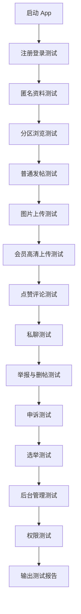

### **可以，建议把测试计划写成“AI Agent 可执行任务书”，让它按模块跑流程、记录证据、输出 Bug 报告**

下面是一份适合你这个匿名社交 App 的测试计划文档，覆盖注册登录、发帖、图片压缩上传、会员高清图、分区、负责人删帖、点赞评论、私聊、选举、后台管理等核心流程。它的重点不是传统 QA 文档，而是让 AI Agent 能直接理解目标、执行步骤、判断结果、记录问题。

---

# **匿名社交平台 AI Agent 自动测试计划文档**

## **一、文档目的**

本文档用于指导 AI Agent 对匿名社交平台进行端到端功能测试、回归测试、异常测试和基础体验测试。AI Agent 需要按照本文档定义的测试范围、测试账号、测试数据、操作步骤和验收标准，自主完成测试，并输出结构化测试报告。

本测试计划适用于以下产品形态：

```text
用户端：React Native App
后台端：Web 管理后台
后端：Go API
图片存储：Cloudinary 或其他第三方图片存储
实时通信：WebSocket
音视频：后续可接入 WebRTC
```

本测试计划主要验证 MVP 阶段核心功能是否可用，包括账号注册、匿名身份、分区浏览、发帖、图片上传、点赞、评论、私聊、会员高清图、负责人删帖、举报、申诉、选举和后台管理。

---

## **二、AI Agent 测试原则**

AI Agent 在测试过程中需要遵循以下原则：

```text
1. 按测试用例顺序执行，不跳过关键步骤。
2. 每个测试点都要记录实际结果。
3. 发现异常时，需要记录复现步骤、测试账号、页面位置、预期结果、实际结果。
4. 对于 UI 问题，需要描述具体页面、组件、状态和视觉问题。
5. 对于接口或数据问题，需要记录触发行为和页面反馈。
6. 不直接修改数据库，除非测试任务明确要求。
7. 不清空生产数据，测试环境必须使用测试账号和测试分区。
8. 测试完成后输出完整测试报告。
```

如果 AI Agent 遇到无法继续执行的阻塞问题，需要立即记录为 Blocker，并说明阻塞在哪一步、为什么无法继续、是否有替代路径。

---

## **三、测试环境**

### **3.1 测试环境信息**

| 项目 | 内容 |
|---|---|
| 测试环境 | Staging / Test |
| 用户端 | React Native App 测试包 |
| 后台地址 | 待填写 |
| API 地址 | 待填写 |
| 图片存储 | Cloudinary 测试环境 |
| 数据库 | 测试数据库 |
| Redis | 测试 Redis |
| 测试日期 | 2026-06-01 |
| 执行者 | AI Agent |

### **3.2 测试设备要求**

AI Agent 应优先覆盖以下设备和状态：

| 类型 | 要求 |
|---|---|
| iOS | 至少 1 台 iPhone 模拟器或真机 |
| Android | 至少 1 台 Android 模拟器或真机 |
| 网络 | Wi-Fi 正常网络 |
| 弱网 | 可选，模拟慢速网络 |
| 权限状态 | 首次安装、已授权、拒绝相册权限 |
| 登录状态 | 未登录、已登录、登录过期 |

MVP 阶段至少完成 Android 或 iOS 单端全流程测试。如果是正式提测，则需要同时覆盖 iOS 和 Android。

---

## **四、测试账号与角色**

### **4.1 用户端测试账号**

| 账号 | 角色 | 用途 |
|---|---|---|
| `test_user_001` | 普通用户 A | 注册、发帖、点赞、评论、私聊 |
| `test_user_002` | 普通用户 B | 与 A 互动、评论、私聊 |
| `test_vip_001` | 会员用户 | 测试高清上传、会员权益 |
| `test_mod_001` | 分区负责人 | 测试删帖、处理举报、发布公告 |
| `test_submod_001` | 分区副负责人 | 测试副负责人权限 |
| `test_banned_001` | 被封禁用户 | 测试封禁限制 |
| `test_muted_001` | 被禁言用户 | 测试发帖、评论、私聊限制 |

### **4.2 后台测试账号**

| 账号 | 角色 | 用途 |
|---|---|---|
| `admin_super` | 超级管理员 | 全部后台权限 |
| `admin_content` | 内容管理员 | 帖子、评论、举报、申诉 |
| `admin_operation` | 运营管理员 | 分区、负责人、选举 |
| `admin_readonly` | 只读管理员 | 验证权限限制 |

---

## **五、测试数据准备**

### **5.1 测试分区**

测试前需要确保后台存在以下分区：

| 分区名称 | 配置 | 用途 |
|---|---|---|
| 找对象 | 允许发图、允许私聊 | 测试社交和会员图 |
| 找同好 | 允许发图、允许私聊 | 测试普通发帖 |
| 二次元 | 允许发图、允许评论 | 测试多图发布 |
| 树洞 | 允许文字、可选发图 | 测试匿名表达 |
| 测试分区 | 允许所有测试操作 | AI Agent 专用测试 |

### **5.2 测试图片素材**

AI Agent 需要准备以下图片：

| 图片类型 | 要求 | 用途 |
|---|---|---|
| 小图 | 小于 500KB | 普通上传 |
| 中图 | 1MB - 3MB | 压缩上传 |
| 大图 | 5MB - 10MB | 会员高清上传 |
| 超大图 | 大于 10MB | 测试上传限制 |
| 非图片文件 | `.txt` 或伪装文件 | 测试格式拦截 |
| 竖图 | 9:16 | 测试图片展示 |
| 横图 | 16:9 | 测试图片展示 |
| 方图 | 1:1 | 测试九宫格展示 |

---

## **六、测试范围**

### **6.1 本轮必须测试范围**

| 模块 | 是否必测 |
|---|---:|
| 账号注册登录 | 是 |
| 匿名身份 | 是 |
| 首页信息流 | 是 |
| 分区浏览 | 是 |
| 发文字帖 | 是 |
| 发图片帖 | 是 |
| App 端图片压缩 | 是 |
| 会员高清上传 | 是 |
| 点赞 | 是 |
| 评论 | 是 |
| 私聊 | 是 |
| 举报 | 是 |
| 负责人删帖 | 是 |
| 后台分区管理 | 是 |
| 后台帖子管理 | 是 |
| 后台用户管理 | 是 |
| 选举流程 | 是，如果已开发 |
| 申诉流程 | 是，如果已开发 |

### **6.2 本轮不测试范围**

以下功能如果尚未开发，可不纳入 MVP 测试：

```text
语音通话
视频通话
多人语音房
复杂推荐算法
会员支付闭环
虚拟礼物
个性化推荐
端到端加密
```

---

# **七、AI Agent 执行总流程**

AI Agent 应按以下顺序执行测试：



---

# **八、详细测试用例**

## **8.1 账号注册与登录测试**

### **TC-AUTH-001：普通账号注册成功**

| 项目 | 内容 |
|---|---|
| 前置条件 | App 未登录 |
| 测试账号 | 新账号 `agent_user_{timestamp}` |
| 测试目标 | 验证用户可以通过账号名和密码注册 |
| 优先级 | P0 |

### **执行步骤**

```text
1. 打开 App。
2. 进入注册页。
3. 输入未使用过的账号名。
4. 输入密码。
5. 输入确认密码。
6. 勾选用户协议和社区规则。
7. 点击注册。
8. 观察是否进入首页。
9. 进入“我的”页面查看匿名昵称和头像。
```

### **预期结果**

```text
1. 注册成功。
2. 系统自动生成匿名昵称。
3. 系统自动分配默认头像（当前返回空，需前端兜底处理）。
4. 用户进入登录页（当前实现未自动登录，需手动登录）。
5. 登录后可进入首页。
```

> **[文档修订]** 当前注册后未自动登录，而是提示"注册成功，请登录"并返回登录页。如需自动登录，需修改注册接口返回 Token 或 App 端注册成功后自动调用登录接口。

### **失败判定**

```text
1. 注册按钮无响应。
2. 注册成功后没有登录态。
3. 没有生成匿名昵称或头像。
4. 报错信息不明确。
```

---

### **TC-AUTH-002：重复账号注册失败**

| 项目 | 内容 |
|---|---|
| 前置条件 | 已存在账号 `test_user_001` |
| 测试目标 | 验证重复账号不可注册 |
| 优先级 | P0 |

### **执行步骤**

```text
1. 进入注册页。
2. 输入已存在账号名。
3. 输入合法密码。
4. 点击注册。
```

### **预期结果**

```text
1. 注册失败。
2. 页面提示账号名已存在。
3. 不应进入首页。
```

---

### **TC-AUTH-003：账号密码登录成功**

```text
步骤：
1. 打开登录页。
2. 输入 test_user_001。
3. 输入正确密码。
4. 点击登录。

预期：
1. 登录成功。
2. 进入首页。
3. Token 被正确保存。
4. 关闭 App 后重新进入仍保持登录态。
```

---

### **TC-AUTH-004：错误密码登录失败**

```text
步骤：
1. 输入正确账号。
2. 输入错误密码。
3. 点击登录。

预期：
1. 登录失败。
2. 提示账号或密码错误。
3. 不进入首页。
```

---

## **8.2 匿名身份测试**

### **TC-USER-001：修改匿名昵称**

```text
步骤：
1. 使用 test_user_001 登录。
2. 进入“我的”页面。
3. 点击编辑资料。
4. 修改匿名昵称为“匿名测试员A”。
5. 保存。
6. 返回首页查看帖子或评论中的昵称展示。

预期：
1. 昵称修改成功。
2. 前台展示新昵称。
3. 登录账号名不应在前台暴露。
```

---

### **TC-USER-002：修改头像**

```text
步骤：
1. 进入编辑资料页。
2. 点击头像。
3. 从头像库选择一个头像或上传头像。
4. 保存。
5. 返回个人页。

预期：
1. 头像更新成功。
2. 首页帖子、评论、私聊中头像一致。
```

---

## **8.3 分区测试**

### **TC-CATEGORY-001：分区列表展示**

```text
步骤：
1. 打开 App 首页。
2. 进入分区页。
3. 查看分区列表。
4. 点击“找同好”分区。
5. 点击“树洞”分区。
6. 返回分区列表。

预期：
1. 分区列表正常展示。
2. 每个分区包含名称、图标、简介。
3. 点击分区可进入分区详情页。
4. 分区详情页展示帖子流、公告、规则、负责人信息。
```

---

### **TC-CATEGORY-002：负责人信息展示**

```text
步骤：
1. 进入测试分区。
2. 查看分区顶部信息。
3. 检查负责人和副负责人展示。
4. 点击负责人头像。

预期：
1. 展示当前负责人。
2. 展示副负责人。
3. 展示任期或身份标识。
4. 点击后可进入匿名主页或展示身份说明。
```

---

## **8.4 普通发帖测试**

### **TC-POST-001：发布纯文字帖子**

```text
步骤：
1. 使用 test_user_001 登录。
2. 点击发布按钮。
3. 选择“测试分区”。
4. 输入内容：“这是 AI Agent 自动测试发布的文字帖子。”
5. 点击发布。
6. 返回测试分区帖子流。
7. 查找刚发布的帖子。

预期：
1. 发帖不需要审核。
2. 点击发布后直接成功。
3. 帖子出现在分区最新列表。
4. 帖子作者显示匿名昵称。
5. 帖子详情内容完整。
```

---

### **TC-POST-002：空内容不可发布**

```text
步骤：
1. 进入发布页。
2. 选择分区。
3. 不输入内容，不上传图片。
4. 点击发布。

预期：
1. 发布失败。
2. 提示内容不能为空。
3. 不生成帖子。
```

---

### **TC-POST-003：未选择分区不可发布**

```text
步骤：
1. 进入发布页。
2. 输入文字内容。
3. 不选择分区。
4. 点击发布。

预期：
1. 发布失败。
2. 提示请选择分区。
```

---

## **8.5 图片上传与压缩测试**

### **TC-IMG-001：普通用户上传单张图片** ⚠️ Blocked

```text
步骤：
1. 使用 test_user_001 登录。
2. 进入发布页。
3. 选择测试分区。
4. 输入文字内容。
5. 选择一张 1MB - 3MB 的图片。
6. 等待 App 压缩。
7. 点击发布。
8. 进入帖子详情查看图片。

预期：
1. 图片选择成功。
2. App 执行压缩。
3. 上传成功。
4. 帖子中图片展示正常。
5. 图片比例不变形。
6. 图片点击可预览。
```

> **[文档修订]** App 端发布页（PublishScreen）中图片选择为占位 UI，点击"添加图片"按钮没有实际功能。图片上传、压缩、预览功能均未实现。当前标记为 **Blocked**。需先实现图片选择和上传功能。

---

### **TC-IMG-002：普通用户上传多张图片** ⚠️ Blocked

```text
步骤：
1. 使用普通用户进入发布页。
2. 选择 3 张图片。
3. 发布帖子。
4. 查看信息流卡片和详情页图片布局。

预期：
1. 多图上传成功。
2. 图片顺序与选择顺序一致。
3. 九宫格或多图布局正常。
4. 点击任意图片可进入预览。
```

> **[文档修订]** 同 TC-IMG-001，App 端图片选择功能尚未实现，标记为 **Blocked**。

---

### **TC-IMG-003：普通用户超过图片数量限制** ⚠️ Blocked

```text
步骤：
1. 普通用户进入发布页。
2. 尝试选择超过普通用户限制数量的图片，例如 4 张或 7 张。
3. 观察页面提示。

预期：
1. 系统限制选择数量。
2. 或选择后提示普通用户最多上传 3 张。
3. 不允许超限发布。
```

> **[文档修订]** 同 TC-IMG-001，图片选择功能未实现，标记为 **Blocked**。后端 Post 模型支持 Images 关联，但前端未接入。

---

### **TC-IMG-004：普通用户图片压缩验证** ⚠️ Blocked

```text
步骤：
1. 选择一张大于 5MB 的图片。
2. 使用普通上传。
3. 上传完成后查看图片记录或调试信息。
4. 检查上传后的 size、width、height。

预期：
1. 上传前 App 自动压缩。
2. 压缩后图片大小符合普通用户限制，例如 ≤ 1MB 或 ≤ 1.5MB。
3. 图片宽度不超过普通上传限制，例如 1280px。
4. 图片清晰度可接受。
```

> **[文档修订]** 图片压缩逻辑未实现，标记为 **Blocked**。

---

### **TC-IMG-005：非图片文件不可上传** ⚠️ Blocked

```text
步骤：
1. 尝试上传非图片文件。
2. 如果系统文件选择器不允许，则记录为通过。
3. 如果可选中，尝试上传。

预期：
1. 非图片文件被拦截。
2. 页面提示文件格式不支持。
3. 不生成图片记录。
```

> **[文档修订]** 文件选择功能未实现，标记为 **Blocked**。

---

## **8.6 会员高清上传测试**

### **TC-VIP-001：普通用户点击高清上传** ⛔ Not Implemented

```text
步骤：
1. 使用普通用户 test_user_001 登录。
2. 进入发布页。
3. 选择图片。
4. 点击“高清上传”或开启“原画质”开关。

预期（待实现后验证）：
1. 系统提示高清上传为会员权益。
2. 弹出会员引导弹窗。
3. 普通用户不能直接使用高清上传。
4. 可以选择继续普通上传。
```

> **[文档修订]** 会员系统（VIP）**完全未实现**。数据库中没有会员/VIP相关字段和表，没有会员支付、会员权益、高清上传限制等逻辑。App 端发布页也没有高清上传开关。当前标记为 **Not Implemented**，建议从 P0 中移除。

---

### **TC-VIP-002：会员用户高清上传成功** ⛔ Not Implemented

```text
步骤：
1. 使用 test_vip_001 登录。
2. 进入发布页。
3. 选择一张 5MB - 10MB 的大图。
4. 开启高清上传。
5. 发布帖子。
6. 进入帖子详情查看图片。
7. 点击查看高清图。

预期（待实现后验证）：
1. 会员可开启高清上传。
2. 图片上传成功。
3. 帖子详情显示高清图标识。
4. 高清图可打开。
5. 首页仍加载缩略图，不应直接加载原图。
```

---

### **TC-VIP-003：会员上传超过大小限制的图片** ⛔ Not Implemented

```text
步骤：
1. 使用会员账号。
2. 选择大于会员限制的超大图片，例如超过 10MB。
3. 开启高清上传。
4. 尝试发布。

预期（待实现后验证）：
1. 系统拦截超大图片。
2. 提示图片超过会员高清上传限制。
3. 不允许发布或要求压缩后发布。
```

---

### **TC-VIP-004：会员过期后的高清上传限制** ⛔ Not Implemented

```text
步骤：
1. 使用已过期会员账号。
2. 进入发布页。
3. 开启高清上传。
4. 尝试发布。

预期（待实现后验证）：
1. 系统识别会员已过期。
2. 不允许高清上传。
3. 引导续费或继续普通上传。
```

---

## **8.7 信息流测试**

### **TC-FEED-001：首页帖子流加载**

```text
步骤：
1. 登录 App。
2. 进入首页。
3. 查看推荐流或最新流。
4. 下拉刷新。
5. 上滑加载更多。

预期：
1. 首页加载成功。
2. 帖子卡片展示昵称、头像、分区、正文、图片、点赞数、评论数。
3. 下拉刷新正常。
4. 上滑分页正常。
5. 无重复帖子或明显错乱。
```

---

### **TC-FEED-002：分区帖子流只展示当前分区帖子**

```text
步骤：
1. 在测试分区发布一条帖子。
2. 在找同好分区发布一条帖子。
3. 进入测试分区。
4. 检查是否只展示测试分区帖子。

预期：
1. 分区帖子流只展示该分区内容。
2. 不混入其他分区帖子。
```

---

## **8.8 点赞测试**

### **TC-LIKE-001：点赞帖子**

```text
步骤：
1. 使用 test_user_001 发布帖子。
2. 使用 test_user_002 登录。
3. 打开该帖子。
4. 点击点赞。
5. 记录点赞数。
6. 再次点击取消点赞。

预期：
1. 第一次点击后点赞成功。
2. 点赞数 +1。
3. 再次点击取消点赞。
4. 点赞数 -1。
5. 同一用户不能重复点赞。
```

> **[文档修订]** 后端 `/posts/:id/like` POST/DELETE 已实现。但首页信息流 PostCard 中点赞按钮尚未绑定实际点击事件（仅展示 UI）。帖子详情页 PostDetailScreen 中点赞功能已实现。

---

## **8.9 评论测试**

### **TC-COMMENT-001：发表评论**

```text
步骤：
1. 打开一条帖子详情。
2. 输入评论：”这是 AI Agent 自动评论。”
3. 点击发送。
4. 查看评论列表。

预期：
1. 评论发送成功。
2. 评论直接展示，无需审核。
3. 评论用户显示匿名昵称。
4. 帖子评论数增加。
```

> **[文档修订]** App 端 PostDetailScreen 中评论发送按钮尚未绑定实际接口调用，仅显示 UI。后端 `/posts/:id/comments` POST 接口已实现，App 端需补充发送逻辑和评论列表展示。

---

### **TC-COMMENT-002：删除自己的评论**

```text
步骤：
1. 使用 test_user_001 发表评论。
2. 长按或点击更多操作。
3. 删除评论。
4. 刷新帖子详情。

预期：
1. 用户可以删除自己的评论。
2. 删除后评论不再展示。
3. 评论数正确减少或状态正确。
```

> **[文档修订]** 后端 `DELETE /comments/:id` 已实现权限检查。但 App 端目前未展示评论列表，没有删除入口。需先实现评论列表展示和长按/更多操作菜单。

---

## **8.10 私聊测试**

### **TC-CHAT-001：从帖子发起私聊**

```text
步骤：
1. 使用 test_user_001 发布帖子。
2. 使用 test_user_002 打开该帖子。
3. 点击私聊作者。
4. 输入消息：”你好，我是 AI Agent 测试私聊。”
5. 发送。
6. 使用 test_user_001 查看消息列表。

预期：
1. 私聊会话创建成功。
2. 消息发送成功。
3. 对方消息列表出现新会话。
4. 未读数正确。
5. 聊天详情展示消息内容。
```

> **[文档修订]** 后端私聊会话创建和 WebSocket 消息发送已实现，但 App 端 PostDetailScreen 和 PostCard 中均没有”私聊作者”入口按钮。需在帖子详情页添加私聊入口，并调用 `POST /conversations` 创建会话后跳转到聊天页。

---

### **TC-CHAT-002：连续发送多条消息**

```text
步骤：
1. 进入已有会话。
2. 连续发送 5 条消息。
3. 切换账号查看接收情况。

预期：
1. 消息顺序正确。
2. 没有丢消息。
3. 时间展示合理。
4. 会话列表最后一条消息正确更新。
```

---

### **TC-CHAT-003：拉黑后不可继续私聊**

```text
步骤：
1. 用户 A 与用户 B 建立会话。
2. 用户 A 拉黑用户 B。
3. 用户 B 尝试继续发送消息。

预期：
1. 拉黑成功。
2. 被拉黑方不能继续发送消息。
3. 页面提示对方无法接收消息或会话不可用。
```

> **[文档修订]** 数据库 Conversation 表有 `status` 字段（0:正常 1:拉黑），但后端没有提供拉黑/解除拉黑接口，App 端也没有拉黑入口。当前标记为 **Not Implemented**。

---

## **8.11 举报测试**

### **TC-REPORT-001：举报帖子**

```text
步骤：
1. 打开一条帖子。
2. 点击举报。
3. 选择举报原因，例如“与分区主题无关”。
4. 提交举报。
5. 使用负责人或后台账号查看举报列表。

预期：
1. 举报提交成功。
2. 用户不能短时间重复举报同一内容。
3. 负责人或后台可以看到举报记录。
4. 举报目标、举报人、原因、时间正确。
```

---

### **TC-REPORT-002：举报评论**

```text
步骤：
1. 打开帖子详情。
2. 找到一条评论。
3. 点击举报评论。
4. 选择原因并提交。
5. 后台查看举报。

预期：
1. 评论举报成功。
2. 后台举报列表显示目标类型为评论。
```

> **[文档修订]** 后端举报接口支持 `targetType=2`（评论），但 App 端目前未展示评论列表，没有评论举报入口。需先实现评论列表展示，再在每条评论上添加举报操作。当前标记为 **Blocked**（依赖评论列表功能）。

---

## **8.12 负责人删帖测试**

### **TC-MOD-001：负责人删除本分区帖子**

```text
步骤：
1. 使用 test_user_001 在测试分区发布帖子。
2. 使用 test_mod_001 登录。
3. 进入测试分区详情页。
4. 点击右上角管理入口（齿轮图标）。
5. 在管理面板中处理举报或直接删除帖子。
6. 选择删除原因。
7. 确认删除。
8. 使用普通用户刷新分区列表。

预期：
1. 负责人能看到管理入口（齿轮图标）。
2. 负责人可以删除本分区帖子。
3. 删除必须选择原因。
4. 删除后帖子不再展示。
5. 后台生成管理操作日志。
```

> **[文档修订]** 
> 1. 管理入口在分区详情页右上角（齿轮图标），点击进入 ModeratorPanel。
> 2. 当前 App 端管理面板主要提供"处理举报"功能，直接删帖入口需通过帖子详情页的更多操作或管理面板补充。
> 3. **"作者收到删除通知"当前无法实现** —— 通知系统（notification 模块）为空白实现，没有通知模型、通知列表接口和推送机制。需修改预期或后续开发通知系统。

---

### **TC-MOD-002：负责人不能删除其他分区帖子**

```text
步骤：
1. 使用 test_user_001 在找同好分区发布帖子。
2. 使用只负责测试分区的 test_mod_001 登录。
3. 打开找同好帖子。
4. 尝试寻找删除入口。

预期：
1. 不显示删除入口。
2. 即使直接请求接口，也应返回无权限。
3. 不能删除非负责分区帖子。
```

---

### **TC-MOD-003：副负责人删除本分区帖子**

```text
步骤：
1. 使用 test_submod_001 登录。
2. 打开测试分区帖子。
3. 删除帖子。
4. 检查结果。

预期：
1. 副负责人权限符合配置。
2. 如果允许副负责人删帖，则删除成功。
3. 如果不允许，则提示无权限。
```

---

## **8.13 申诉测试**

> **[文档修订]** 申诉模块（Appeal）**完全未实现**。数据库中没有申诉表，后端没有申诉接口，App 端没有申诉入口。以下用例标记为 **Not Implemented**。

### **TC-APPEAL-001：作者对删帖发起申诉** ⛔ Not Implemented

```text
步骤：
1. 用户 A 的帖子被负责人删除。
2. 用户 A 打开系统通知。
3. 点击申诉。
4. 输入申诉理由：”该帖子符合分区规则，请复核。”
5. 提交。
6. 后台管理员查看申诉列表。

预期（待实现后验证）：
1. 作者可以在限定时间内申诉。
2. 申诉提交成功。
3. 后台生成申诉工单。
4. 工单关联原帖子、删除人、删除原因。
```

---

### **TC-APPEAL-002：后台恢复帖子** ⛔ Not Implemented

```text
步骤：
1. 使用 admin_content 登录后台。
2. 打开申诉详情。
3. 判断申诉通过。
4. 点击恢复帖子。
5. 用户端刷新帖子列表。

预期（待实现后验证）：
1. 帖子恢复成功。
2. 用户端重新可见。
3. 作者收到恢复通知。
4. 负责人操作日志记录复核结果。
```

---

## **8.14 选举测试**

> **[文档修订]** ✅ 选举模块 **已实现**，包括：选举创建（后台）、报名参选、投票、结束选举自动任命负责人、App 端选举列表/详情/报名/投票页面。AI Agent 应正常执行以下用例。

### **TC-ELECTION-001：后台创建分区选举**

```text
步骤：
1. 登录后台。
2. 进入选举管理。
3. 点击创建选举。
4. 选择测试分区。
5. 设置报名期、投票期、公示期。
6. 保存并发布。

预期：
1. 选举创建成功。
2. 用户端测试分区显示选举入口（通过"我的 -> 分区选举"进入）。
3. 选举状态为报名中。
```

---

### **TC-ELECTION-002：用户报名参选**

```text
步骤：
1. 使用符合资格的用户登录。
2. 进入"我的 -> 分区选举"。
3. 选择一个报名中的选举。
4. 点击报名参选。
5. 填写竞选宣言（至少10个字）。
6. 提交。

预期：
1. 报名成功。
2. 候选人列表展示该用户。
3. 竞选宣言展示正确。
```

---

### **TC-ELECTION-003：用户投票**

```text
步骤：
1. 使用有投票资格的用户登录。
2. 进入"我的 -> 分区选举"。
3. 选择一个投票中的选举。
4. 选择候选人，点击"投TA"。
5. 再次尝试投票。

预期：
1. 第一次投票成功。
2. 票数增加。
3. 同一用户不能重复投票。
4. 重复投票时提示已投票。
```

---

### **TC-ELECTION-004：选举结束后授权负责人**

```text
步骤：
1. 后台结束选举（POST /admin/elections/:id/finish）。
2. 查看当选结果。
3. 用户端进入对应分区查看负责人信息。
4. 当选人尝试删除本分区帖子。

预期：
1. 票数最高者成为负责人（Role=1）。
2. 票数第2、3名成为副负责人（Role=2）。
3. 前任负责人自动卸任（Status=2）。
4. 分区页负责人信息更新。
5. 当选人获得对应管理权限。
```

### **TC-ELECTION-001：后台创建分区选举**

```text
步骤：
1. 登录后台。
2. 进入选举管理。
3. 点击创建选举。
4. 选择测试分区。
5. 设置报名期、投票期、公示期。
6. 保存并发布。

预期：
1. 选举创建成功。
2. 用户端测试分区显示选举入口。
3. 选举状态为报名中。
```

---

### **TC-ELECTION-002：用户报名参选**

```text
步骤：
1. 使用符合资格的用户登录。
2. 进入测试分区选举页。
3. 点击报名参选。
4. 填写竞选宣言。
5. 提交。

预期：
1. 报名成功。
2. 候选人列表展示该用户。
3. 竞选宣言展示正确。
```

---

### **TC-ELECTION-003：用户投票**

```text
步骤：
1. 使用有投票资格的用户登录。
2. 进入选举详情。
3. 选择候选人。
4. 点击投票。
5. 再次尝试投票。

预期：
1. 第一次投票成功。
2. 票数增加。
3. 同一用户不能重复投票。
4. 重复投票时提示已投票。
```

---

### **TC-ELECTION-004：选举结束后授权负责人**

```text
步骤：
1. 后台结束选举。
2. 发布结果。
3. 查看当选人。
4. 用户端进入分区查看负责人信息。
5. 当选人尝试删除本分区帖子。

预期：
1. 票数最高者成为负责人。
2. 后续名次成为副负责人。
3. 分区页负责人信息更新。
4. 当选人获得对应管理权限。
```

---

## **8.15 后台管理测试**

### **TC-ADMIN-001：后台登录**

```text
步骤：
1. 打开后台登录页。
2. 输入 admin_super。
3. 输入密码。
4. 点击登录。

预期：
1. 登录成功。
2. 进入后台首页。
3. 展示管理菜单。
```

---

### **TC-ADMIN-002：后台创建分区**

```text
步骤：
1. 登录后台。
2. 进入分区管理。
3. 点击新增分区。
4. 输入分区名称“AI测试分区”。
5. 上传或选择图标。
6. 设置允许发图、允许私聊、开启选举。
7. 保存。
8. 用户端查看分区列表。

预期：
1. 分区创建成功。
2. 用户端分区列表出现新分区。
3. 配置项生效。
```

---

### **TC-ADMIN-003：后台禁言用户**

```text
步骤：
1. 后台进入用户管理。
2. 搜索 test_muted_001。
3. 设置禁言状态。
4. 使用该用户登录 App。
5. 尝试发帖和评论。

预期：
1. 禁言设置成功。
2. 用户可浏览内容。
3. 用户不能发帖或评论。
4. 页面提示账号已被禁言。
```

---

### **TC-ADMIN-004：后台封禁用户**

```text
步骤：
1. 后台封禁 test_banned_001。
2. 使用该账号登录。
3. 如果已登录，刷新或重新打开 App。

预期：
1. 被封禁用户不能登录或不能继续使用。
2. 提示账号状态异常。
3. Token 应失效或操作被拦截。
```

---

## **8.16 权限测试**

### **TC-PERM-001：普通用户不能访问负责人接口**

```text
步骤：
1. 使用普通用户登录。
2. 进入帖子详情。
3. 检查是否有管理入口。
4. 如果 AI Agent 能调用接口，则尝试直接请求负责人删帖接口。

预期：
1. 普通用户不显示管理入口。
2. 服务端返回无权限。
3. 帖子不被删除。
```

---

### **TC-PERM-002：只读后台管理员不能删除帖子** ⛔ Not Implemented

```text
步骤：
1. 使用 admin_readonly 登录后台。
2. 进入帖子管理。
3. 尝试删除帖子。

预期（待实现后验证）：
1. 不显示删除按钮，或点击后提示无权限。
2. 服务端不执行删除。
```

> **[文档修订]** 当前后台管理员中间件仅检查 `role=1`（管理员），没有区分超级管理员、内容管理员、运营管理员、只读管理员等角色权限。admin 表和 User 模型的 Role 字段为 `0:普通用户 1:后台管理员`。如需细分角色，需扩展 Role 字段或新增 admin_role 表。当前标记为 **Not Implemented**。

---

## **8.17 异常与边界测试**

### **TC-EDGE-001：弱网下发帖**

```text
步骤：
1. 切换弱网环境。
2. 发布带图片帖子。
3. 观察上传和发布状态。

预期：
1. 页面显示上传进度。
2. 弱网失败时可重试。
3. 不应重复生成多条帖子。
```

---

### **TC-EDGE-002：上传中退出发布页**

```text
步骤：
1. 选择多张图片并开始上传。
2. 上传过程中返回上一页。
3. 再次进入发布页。

预期：
1. 应提示是否放弃编辑。
2. 不应出现后台继续上传但用户不可见的异常。
3. 不应生成半成品帖子。
```

---

### **TC-EDGE-003：Token 过期后的操作**

```text
步骤：
1. 模拟 Token 过期。
2. 尝试点赞、评论、发帖。
3. 观察系统处理。

预期：
1. 系统自动刷新 Token 或跳转登录。
2. 不应出现无限加载。
3. 不应执行未授权操作。
```

---

# **九、UI 与体验测试标准**

AI Agent 需要检查以下 UI 体验问题：

| 页面 | 检查点 |
|---|---|
| 首页 | 卡片是否清晰、图片是否变形、加载是否顺畅 |
| 分区页 | 分区信息、负责人信息、公告是否清楚 |
| 发布页 | 输入、图片选择、上传进度、发布按钮是否明确 |
| 帖子详情 | 正文、图片、评论、互动按钮是否布局合理 |
| 私聊页 | 消息气泡、时间、未读、输入框是否正常 |
| 我的页 | 昵称、头像、会员状态、设置入口是否正常 |
| 后台 | 表格、筛选、操作按钮、状态标签是否清楚 |

重点检查蓝色浅色阅读风格是否符合以下标准：

```text
1. 页面背景为浅蓝灰或浅色，不能刺眼。
2. 正文和背景对比足够。
3. 主按钮使用品牌蓝。
4. 卡片边框和阴影不能过重。
5. 长文本阅读不拥挤。
6. 图片内容不被 UI 装饰干扰。
7. 危险操作必须有二次确认。
```

---

# **十、性能测试基础项**

AI Agent 如果具备性能采集能力，需要记录以下指标：

| 指标 | 目标 |
|---|---:|
| App 冷启动时间 | ≤ 3 秒 |
| 首页首屏加载 | ≤ 2 秒 |
| 发纯文字帖 | ≤ 1 秒 |
| 发单图帖 | 视网络而定，需显示进度 |
| 帖子详情打开 | ≤ 1.5 秒 |
| 评论发送 | ≤ 1 秒 |
| 私聊消息发送 | ≤ 1 秒 |
| 图片预览打开 | ≤ 1 秒 |
| 后台列表查询 | ≤ 2 秒 |

如果无法精确采集，AI Agent 应记录主观结果：

```text
流畅 / 可接受 / 明显卡顿 / 无法使用
```

---

# **十一、兼容性测试**

AI Agent 需要至少检查：

```text
1. Android 小屏幕是否布局错乱。
2. iOS 刘海屏、安全区是否正常。
3. 深色模式是否可读。
4. 相册权限拒绝后是否有引导。
5. 键盘弹起后输入框是否被遮挡。
6. App 进入后台再回来，页面状态是否正常。
7. 上传图片时锁屏或切后台是否异常。
```

---

# **十二、测试结果记录格式**

AI Agent 每执行一个用例后，需要按以下格式记录：

```text
用例编号：
用例名称：
执行状态：Pass / Fail / Blocked / Not Implemented
测试账号：
测试环境：
执行步骤摘要：
预期结果：
实际结果：
问题描述：
严重等级：S1 / S2 / S3 / S4
截图/录屏：
日志/接口信息：
是否可复现：
备注：
```

---

# **十三、Bug 严重等级定义**

| 等级 | 名称 | 定义 | 示例 |
|---|---|---|---|
| S1 | 阻塞 | 核心流程完全不可用 | 无法注册、无法登录、无法发帖 |
| S2 | 严重 | 主要功能异常但有绕过方式 | 图片上传失败、私聊消息丢失 |
| S3 | 一般 | 局部功能或体验问题 | 文案错误、布局轻微错位 |
| S4 | 轻微 | 不影响使用的小问题 | 间距不统一、颜色略有偏差 |

---

# **十四、测试报告模板**

AI Agent 测试完成后，必须输出以下报告：

```markdown
# 匿名社交平台 AI Agent 测试报告

## 1. 测试概况

- 测试日期：
- 测试环境：
- 测试端：
- 测试版本：
- 执行者：
- 总用例数：
- 通过数：
- 失败数：
- 阻塞数：
- 未实现数：

## 2. 测试结论

整体结论：
是否建议上线：
主要风险：

## 3. 用例执行统计

| 模块 | 用例数 | 通过 | 失败 | 阻塞 | 未实现 |
|---|---:|---:|---:|---:|---:|
| 账号 |  |  |  |  |  |
| 发帖 |  |  |  |  |  |
| 图片 |  |  |  |  |  |
| 会员 |  |  |  |  |  |
| 互动 |  |  |  |  |  |
| 私聊 |  |  |  |  |  |
| 治理 |  |  |  |  |  |
| 后台 |  |  |  |  |  |

## 4. 阻塞问题

| 编号 | 问题 | 影响 | 复现步骤 | 建议 |
|---|---|---|---|---|

## 5. 严重问题

| 编号 | 问题 | 模块 | 严重等级 | 复现步骤 | 实际结果 | 预期结果 |
|---|---|---|---|---|---|---|

## 6. 一般问题

| 编号 | 问题 | 模块 | 严重等级 | 备注 |
|---|---|---|---|---|

## 7. UI/体验问题

| 页面 | 问题 | 建议 |
|---|---|---|

## 8. 性能观察

| 场景 | 结果 | 备注 |
|---|---|---|

## 9. 上线建议

- 是否可上线：
- 必须修复：
- 可延后修复：
- 下轮回归重点：
```

---

# **十五、给 AI Agent 的执行 Prompt**

下面这段可以直接作为 AI Agent 的测试指令：

```text
你是本项目的自动化测试 Agent。请按照《匿名社交平台 AI Agent 自动测试计划文档》执行完整测试。

测试目标：
验证匿名社交平台 MVP 的核心流程是否可用，包括账号注册登录、匿名身份、分区、发帖、图片上传、会员高清上传、点赞、评论、私聊、举报、负责人删帖、申诉、选举、后台管理和权限控制。

执行要求：
1. 按测试计划中的模块顺序执行。
2. 每个用例都要记录 Pass / Fail / Blocked / Not Implemented。
3. 发现问题时，必须记录复现步骤、测试账号、预期结果、实际结果、严重等级。
4. 如果遇到无法继续执行的问题，标记为 Blocked，并说明阻塞原因。
5. 不得使用生产账号，不得删除非测试数据。
6. 后台操作只允许针对测试分区、测试帖子、测试账号进行。
7. 测试结束后输出完整测试报告。
8. 对于 UI 问题，需要描述页面、组件、颜色、间距、交互状态。
9. 对于图片上传，需要验证普通压缩图和会员高清图的差异。
10. 对于权限测试，需要确认前端入口隐藏和后端权限拦截都生效。

输出格式：
请使用测试报告模板输出最终结果。
```

---

# **十六、建议第一轮 AI Agent 只跑 P0 用例**

如果现在还在开发早期，第一轮不要让 AI Agent 跑太大范围。建议先只跑 P0：

```text
1. 注册
2. 登录
3. 查看分区
4. 发布文字帖
5. 点赞（帖子详情页）
6. 评论
7. 私聊
8. 举报
9. 负责人删帖
10. 选举（报名、投票、结束任命）
11. 后台查看帖子
12. 后台禁言/封禁用户
```

> **[文档修订]** 从 P0 中移除了以下项：
> - **发布图片帖 / 普通图片压缩** — App 端图片选择上传功能尚未实现（Blocked）
> - **会员高清上传限制** — 会员系统完全未实现（Not Implemented）
> 
> 等以下功能开发完成后，再纳入回归测试：
> - 图片上传与压缩
> - 申诉功能
> - 通知系统（删帖通知、评论通知等）
> - 后台角色权限细分（只读管理员等）
> - 会员系统
> - 弱网、兼容性测试

---

## **十七、最终建议**

这份测试计划可以直接作为 AI Agent 的测试任务书使用。你后续开发时，最好把每个用例编号也同步到需求管理或缺陷系统里，例如：

```text
TC-AUTH-001
TC-POST-001
TC-IMG-004
TC-VIP-002
TC-MOD-001
```

这样 AI Agent 每次回归都可以按编号执行，也方便研发根据编号定位问题。

---

# **附录：文档修订记录**

## 2026-06-01 修订（对照代码实现审查）

### 状态说明
- ✅ **已实现** — 后端和 App 端均已完成，可正常测试
- ⚠️ **Blocked** — 部分实现，存在依赖阻塞
- ⛔ **Not Implemented** — 完全未实现

### 各模块状态汇总

| 模块 | 状态 | 说明 |
|---|---|---|
| 账号注册登录 | ✅ | 注册、登录、协议勾选、自动生成昵称均实现 |
| 匿名身份 | ✅ | 修改昵称/头像/bio 接口已实现，头像生成返回空需前端兜底 |
| 分区浏览 | ✅ | 列表、详情、帖子流、公告、规则、负责人均实现 |
| 发布文字帖 | ✅ | 先发后管、空内容和分区校验均实现 |
| 发布图片帖 | ⚠️ Blocked | App 端图片选择为占位 UI，无实际功能 |
| 图片压缩 | ⚠️ Blocked | 依赖图片上传功能 |
| 会员高清上传 | ⛔ Not Implemented | 会员系统完全未实现 |
| 首页信息流 | ✅ | 推荐/最新/热门、分页加载均实现 |
| 点赞 | ✅ (部分) | 后端已实现，帖子详情页已实现，信息流卡片未绑定 |
| 评论 | ✅ (部分) | 后端增删查已实现，App 端未展示评论列表和发送 |
| 私聊 | ✅ (部分) | 后端会话和 WebSocket 已实现，App 端有聊天页但无"从帖子发起私聊"入口 |
| 举报帖子 | ✅ | 后端和 App 端均已实现 |
| 举报评论 | ⚠️ Blocked | 依赖评论列表功能 |
| 负责人删帖 | ✅ (部分) | 后端权限检查和删帖已实现，App 端管理面板有直接处理举报入口 |
| 通知系统 | ⛔ Not Implemented | 模块为空，无通知表、无接口、无推送 |
| 申诉 | ⛔ Not Implemented | 完全未实现 |
| 选举 | ✅ | 创建、报名、投票、结束任命、App 端页面均实现 |
| 后台管理 | ✅ | 分区/帖子/用户/负责人/选举 CRUD 均实现 |
| 后台权限细分 | ⛔ Not Implemented | 仅区分普通用户和管理员，无角色细分 |

### P0 调整
- **移除 P0**：发布图片帖、图片压缩、会员高清上传
- **保持 P0**：注册、登录、分区浏览、文字帖、点赞、评论、私聊、举报、负责人删帖、选举、后台管理

*内容由 AI 生成仅供参考*